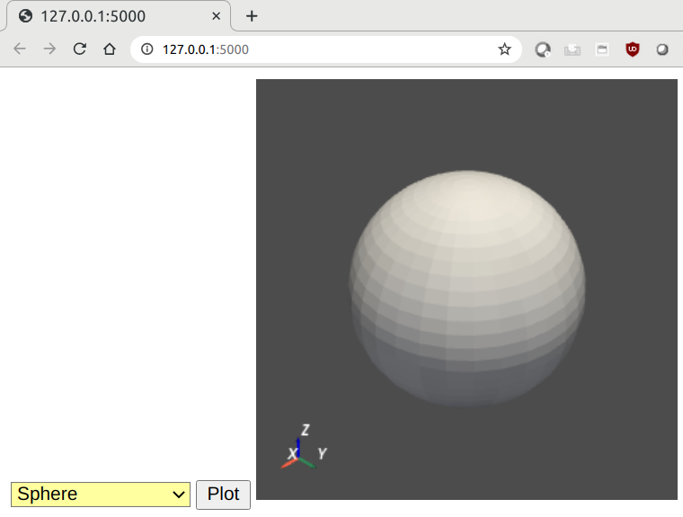

.. _ref_flask:

Flask Application
=================
You can use ``pyvista`` in to make a flask application to display both static
and dynamic plots.  See the following examples as well as the source at `Flask
Example <https://github.com/pyvista/pyvista/tree/main/examples_flask>`__.

Dynamic Example
---------------

.. figure:: ../images/gifs/dynamic_flask.gif

    Example Dynamic Flask Webpage

Python Application ``app.py``
~~~~~~~~~~~~~~~~~~~~~~~~~~~~~

.. literalinclude:: ../../examples_flask/dynamic_ex/app.py

Ajax Template ``index.html``
~~~~~~~~~~~~~~~~~~~~~~~~~~~~
This template should be within the ``templates`` directory in the same
path as ``app.py``.

This template returns the ``meshtype`` parameter back to the
``get_img`` method in the flask app, which is used to select the type
of mesh to be plotted.

.. literalinclude:: ../../examples_flask/dynamic_ex/templates/index.html

Static Example
--------------

    Example Static Flask Webpage

Python Application ``app.py``
~~~~~~~~~~~~~~~~~~~~~~~~~~~~~

.. literalinclude:: ../../examples_flask/static_ex/app.py

Ajax Template ``index.html``
~~~~~~~~~~~~~~~~~~~~~~~~~~~~
This template should be within the ``templates`` directory in the same
path as ``app.py``.

This template returns the ``meshtype`` parameter back to the
``get_img`` method in the flask app, which is used to select the type
of mesh to be plotted.

.. literalinclude:: ../../examples_flask/static_ex/templates/index.html
