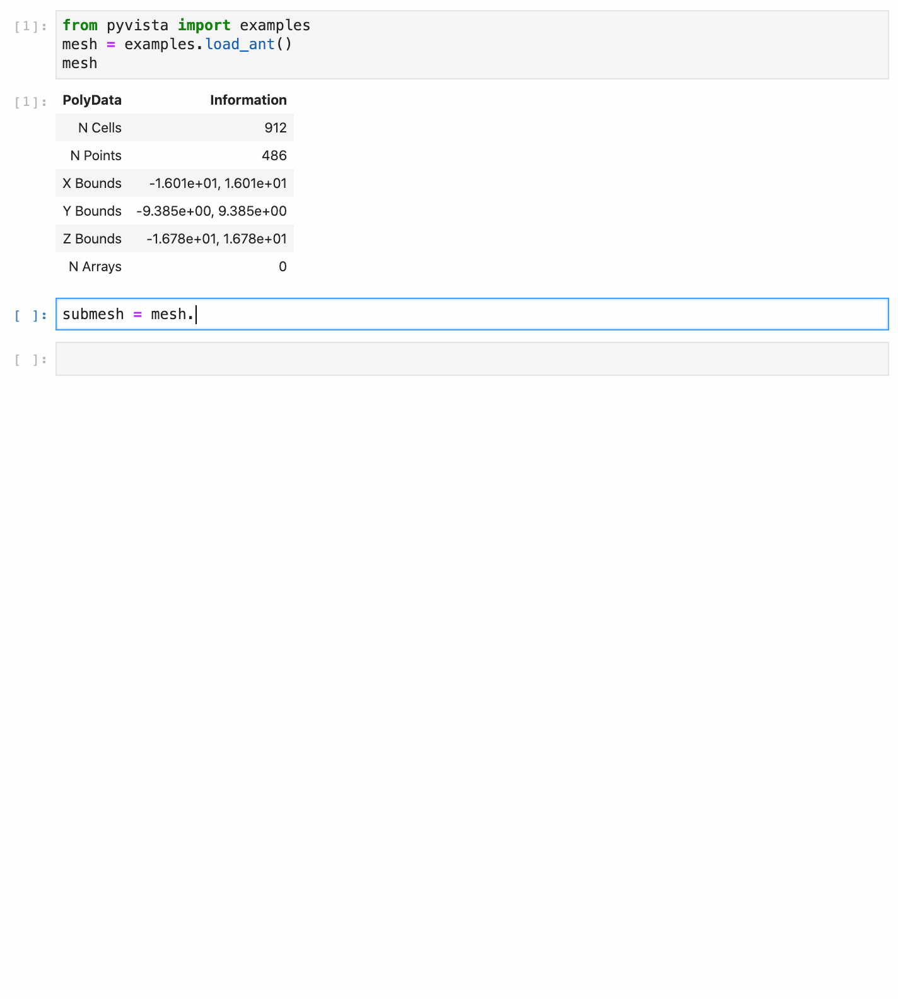

Why PyVista?
============

.. jupyter-execute::
   :hide-code:

   # jupyterlab boiler plate setup
   import pyvista
   pyvista.set_jupyter_backend('pythreejs')
   pyvista.global_theme.background = 'white'
   pyvista.global_theme.window_size = [600, 400]
   pyvista.global_theme.axes.show = False
   pyvista.global_theme.antialiasing = True
   pyvista.global_theme.show_scalar_bar = False

VTK is an excellent visualization toolkit, and with Python bindings it
should be able to combine the speed of C++ with the rapid prototyping
of Python.  However, despite this VTK code programmed in Python
generally looks the same as its C++ counterpart.  This module seeks to
simplify mesh creation and plotting without losing functionality.

Compare two approaches for loading and plotting a surface mesh from a
file:

Plotting a Mesh using Python's VTK
~~~~~~~~~~~~~~~~~~~~~~~~~~~~~~~~~~
Using this `example
<https://kitware.github.io/vtk-examples/site/Python/IO/ReadSTL/>`_ as
a baseline example, loading and plotting an STL file requires a lot of
code when using only the ``vtk`` module.

+----------------------------------------------+-------------------------------------------+
| Read a stl file using ``vtk``                | Read a stl file using ``pyvista``         |
+==============================================+===========================================+
| .. code:: python                             | .. code:: python                          |
|                                              |                                           |
|     import vtk                               |     import pyvista                        |
|                                              |                                           |
|     # create reader                          |     mesh = pyvista.read('myfile.stl')     |
|     reader = vtk.vtkSTLReader()              |     mesh.plot()                           |
|     reader.SetFileName("myfile.stl")         |                                           |
|                                              |                                           |
|     mapper = vtk.vtkPolyDataMapper()         |                                           |
|     output_port = reader.GetOutputPort()     |                                           |
|     mapper.SetInputConnection(output_port)   |                                           |
|                                              |                                           |
|     # create actor                           |                                           |
|     actor = vtk.vtkActor()                   |                                           |
|     actor.SetMapper(mapper)                  |                                           |
|                                              |                                           |
|     # Create a rendering window and renderer |                                           |
|     ren = vtk.vtkRenderer()                  |                                           |
|     renWin = vtk.vtkRenderWindow()           |                                           |
|     renWin.AddRenderer(ren)                  |                                           |
|                                              |                                           |
|     # Create a renderwindowinteractor        |                                           |
|     iren = vtk.vtkRenderWindowInteractor()   |                                           |
|     iren.SetRenderWindow(renWin)             |                                           |
|                                              |                                           |
|     # Assign actor to the renderer           |                                           |
|     ren.AddActor(actor)                      |                                           |
|                                              |                                           |
|     # Enable user interface interactor       |                                           |
|     iren.Initialize()                        |                                           |
|     renWin.Render()                          |                                           |
|     iren.Start()                             |                                           |
|                                              |                                           |
|     # clean up objects                       |                                           |
|     del iren                                 |                                           |
|     del renWin                               |                                           |
+----------------------------------------------+-------------------------------------------+

The PyVista data model and API allows you to rapidly load meshes and
handles much of the "grunt work" of setting up plots, connecting
classes and pipelines, and cleaning up plotting windows.  It does this
by exposing a simplified, but functional, interface to VTK's classes.

In :func:`pyvista.read`, PyVista automatically determines the correct
file reader based on the file extension and returns a DataSet object.
This dataset object contains all the methods that are available to a
:class:`pyvista.PolyData` class, including the :func:`pyvista.plot`
method, allowing you to instantly generate a plot of the mesh.
Garbage collection is taken care of automatically and the renderer is
cleaned up after the user closes the plotting window.

PyVista API
~~~~~~~~~~~
For example, triangular surface meshes in VTK can be subdivided but
every other object in VTK cannot.  It then makes sense that a
subdivided method be added to the existing triangular surface mesh.
That way, subdivision can be performed with:

.. jupyter-execute::

    import pyvista
    mesh = pyvista.Plane().triangulate()
    submesh = mesh.subdivide(2, 'linear')
    submesh.plot(show_edges=True)

Additionally, the docstrings for all methods in PyVista are intended
to be used within interactive coding sessions. This allows users to
use sophisticated processing routines on the fly with immediate access
to a description of how to use those methods:

Tradeoffs
~~~~~~~~~
While most features can, not everything can be simplified without
losing functionality or performance.

In the :class:`collision <pyvista.PolyDataFilters.collision>` filter,
we demonstrate how to calculate the collision between two meshes.  For
example:

.. jupyter-execute::

   import pyvista

   # create a default sphere and a shifted sphere
   mesh_a = pyvista.Sphere()
   mesh_b = pyvista.Sphere(center=(-0.4, 0, 0))
   out, n_coll = mesh_a.collision(mesh_b, generate_scalars=True, contact_mode=2)

   pl = pyvista.Plotter()
   pl.add_mesh(out)
   pl.add_mesh(mesh_b, style='wireframe', color='k')
   pl.camera_position = 'xy'
   pl.show()

Under the hood, the collision filter detects mesh collisions using a
oriented bounding box (OBB) trees.  For a single collision, this filter
is as performant as the vtk counterpart, but when computing multiple
collisions with the same meshes, as in the :ref:`collision_example`
example, it is more efficient (though less convienent) to use the VTK
underlying `vtkCollisionDetectionFilter
<https://vtk.org/doc/nightly/html/classvtkCollisionDetectionFilter.html>`_,
as the OBB tree is computed once for each mesh.  In most cases, pure
PyVista is sufficient for most data science, but there are times when
you may want to use VTK classes directly.

Note that nothing stops you from using VTK classes and then wrapping
the output with PyVista.  For example:

.. jupyter-execute::
   
   import vtk
   import pyvista

   # Create a circle using vtk
   polygonSource = vtk.vtkRegularPolygonSource()
   polygonSource.GeneratePolygonOff()
   polygonSource.SetNumberOfSides(50)
   polygonSource.SetRadius(5.0)
   polygonSource.SetCenter(0.0, 0.0, 0.0)
   polygonSource.Update()

   # wrap and plot using pyvista
   mesh = pyvista.wrap(polygonSource.GetOutput())
   mesh.plot(line_width=3, cpos='xy', color='k')

In this manner, you can get the "best of both worlds" should you need
the flexibility of PyVista and the functionality of VTK.

.. note::
   You can use :func:`pyvista.Circle` for a one line replacement of
   the above VTK code.

Interfacing with other Libraries
~~~~~~~~~~~~~~~~~~~~~~~~~~~~~~~~
PyVista is heavily dependent on `numpy <https://numpy.org/>`_ and uses
it to represent point, cell, field, and other data from the VTK
meshes.  This data can be easily accessed from the dataset attributes
like :attr:`pyvista.DataSet.points`.  For example the first 10 points
of a circle from pyvista can be accessed with:

.. jupyter-execute::

   circle = pyvista.Circle()
   circle.points[:10]

And these points can be operated on as if it was a ``numpy`` array,
all without losing connection to the underlying VTK data array.

At the same time, a variety of PyVista objects can be generated
directly from numpy arrays.  For example, below we generate a vector
field of arrows using :func:`numpy.meshgrid`:

.. jupyter-execute::

    import pyvista
    import numpy as np

    # Make a grid
    x, y, z = np.meshgrid(np.linspace(-5, 5, 20),
                          np.linspace(-5, 5, 20),
                          np.linspace(-5, 5, 5))

    points = np.empty((x.size, 3))
    points[:, 0] = x.ravel('F')
    points[:, 1] = y.ravel('F')
    points[:, 2] = z.ravel('F')

    # Compute a direction for the vector field
    direction = np.sin(points)**3

    # plot using the plotting class
    pl = pyvista.Plotter()
    pl.add_arrows(points, direction, 0.5)
    pl.show()

PyVista has connections to several other libraries, such as `meshio
<https://github.com/nschloe/meshio>`_, `matplotlib
<https://matplotlib.org/>`_, allowing PyVista to extend VTK with
functionality from the python ecosystem.
