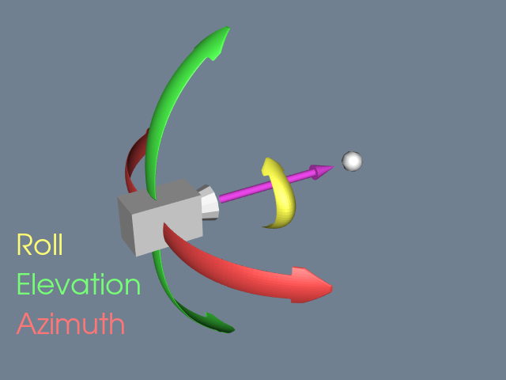

.. _cameras_api:

Cameras
=======
The :class:`pyvista.Camera` class adds additional functionality and a
pythonic API to the :vtk:`vtkCamera` class. :class:`pyvista.Camera`
objects come with a default set of cameras that work well in most
cases, but in many situations a more hands-on approach to using the
camera is necessary.

Brief Example
-------------

Create a frustum of camera, then create a scene of inside frustum.

.. pyvista-plot::

    import pyvista as pv
    import numpy as np
    import vtk
    from pyvista import examples

    pv.set_plot_theme("document")

    camera = pv.Camera()
    near_range = 0.3
    far_range = 0.8
    camera.clipping_range = (near_range, far_range)
    unit_vector = np.array(camera.direction) / np.linalg.norm(
        np.array([camera.focal_point]) - np.array([camera.position])
    )

    frustum = camera.view_frustum(1.0)

    position = camera.position
    focal_point = camera.focal_point
    line = pv.Line(position, focal_point)

    bunny = examples.download_bunny()
    xyz = camera.position + unit_vector * 0.6 - np.mean(bunny.points, axis=0)
    bunny.translate(xyz, inplace=True)

    pl = pv.Plotter(shape=(2, 1))
    pl.subplot(0, 0)
    pl.add_text("Camera Position")
    pl.add_mesh(bunny)
    pl.add_mesh(frustum, style="wireframe")
    pl.add_mesh(bunny)
    pl.add_mesh(line, color="b")
    pl.add_point_labels(
        [
            position,
            camera.position + unit_vector * near_range,
            camera.position + unit_vector * far_range,
            focal_point,
        ],
        ["Camera Position", "Near Clipping Plane", "Far Clipping Plane", "Focal Point"],
        margin=0,
        fill_shape=False,
        font_size=14,
        shape_color="white",
        point_color="red",
        text_color="black",
    )
    pl.camera.position = (1.1, 1.5, 0.0)
    pl.camera.focal_point = (0.2, 0.3, 0.3)
    pl.camera.up = (0.0, 1.0, 0.0)
    pl.camera.zoom(1.4)

    pl.subplot(1, 0)
    pl.add_text("Camera View")
    pl.add_mesh(bunny)
    pl.camera = camera
    pl.show()

Controlling Camera Rotation
---------------------------
In addition to directly controlling the camera position by setting it
via the :py:attr:`pyvista.Camera.position` property, you can also
directly control the :py:attr:`pyvista.Camera.roll`,
:py:attr:`pyvista.Camera.elevation`, and
:py:attr:`pyvista.Camera.azimuth` of the camera.

For example, you can modify the roll. First, generate a plot of an
orientation cube while initially setting the camera position to look
at the ``'yz'``.

.. pyvista-plot::

   import pyvista
   from pyvista import demos
   pl = demos.orientation_plotter()
   pl.camera_position = 'yz'
   pl.show()

Here we modify the roll in-place.

.. pyvista-plot::

   import pyvista
   from pyvista import demos
   pl = demos.orientation_plotter()
   pl.camera_position = 'yz'
   pl.camera.roll += 10
   pl.show()

And here we offset the azimuth of the camera by 45 degrees to look at
the ``X+`` and ``Y+`` faces.

.. pyvista-plot::

   import pyvista
   from pyvista import demos
   pl = demos.orientation_plotter()
   pl.camera_position = 'yz'
   pl.camera.azimuth = 45
   pl.show()

Here, we move upward by setting the elevation of the camera to 45
degrees to see the ``X+`` and ``Z+`` faces.

.. pyvista-plot::

   import pyvista
   from pyvista import demos
   pl = demos.orientation_plotter()
   pl.camera_position = 'yz'
   pl.camera.elevation = 45
   pl.show()

API Reference
~~~~~~~~~~~~~
.. autosummary::
   :toctree: _autosummary

   pyvista.Camera
