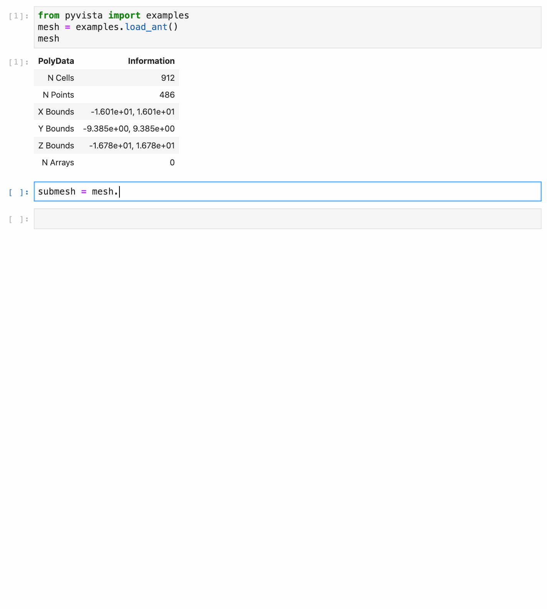

.. _why_pyvista:

Why PyVista?
============

.. jupyter-execute::
   :hide-code:

   # jupyterlab boilerplate setup
   import pyvista as pv

   pv.set_jupyter_backend('static')
   pv.global_theme.background = 'white'
   pv.global_theme.window_size = [600, 400]
   pv.global_theme.axes.show = False
   pv.global_theme.anti_aliasing = 'fxaa'
   pv.global_theme.show_scalar_bar = False

VTK is an excellent visualization toolkit, and with Python bindings it
should be able to combine the speed of C++ with the rapid prototyping
of Python. However, despite this VTK code programmed in Python
generally looks the same as its C++ counterpart. This module seeks to
simplify mesh creation and plotting without losing functionality.

Compare two approaches for loading and plotting a surface mesh from a
file:

Plotting a Mesh using Python's VTK
~~~~~~~~~~~~~~~~~~~~~~~~~~~~~~~~~~
Using this `example
<https://kitware.github.io/vtk-examples/site/Python/IO/ReadSTL/>`_ as
a baseline, loading and plotting an STL file requires a lot of code
when using only the `vtk`_ library. PyVista on the other hand only
requires a few lines of code.

.. pyvista-plot::
   :include-source: False
   :context:

   >>> bunny_cpos = [
   ...     (0.14826, 0.275729, 0.4215911),
   ...     (-0.01684, 0.110154, -0.0015369),
   ...     (-0.15446, 0.939031, -0.3071841),
   ... ]

+----------------------------------------------------+-------------------------------------+
| Read and plot STL file using `vtk`_                | Read an STL file using PyVista      |
+====================================================+=====================================+
| .. code-block:: python                             | .. code-block:: python              |
|                                                    |                                     |
|    import vtk                                      |    import pyvista as pv             |
|    reader = vtk.vtkSTLReader()                     |    mesh = pv.read('bunny.stl')      |
|    reader.SetFileName("bunny.stl")                 |    mesh.plot()                      |
|    mapper = vtk.vtkDataSetMapper()                 |                                     |
|    output_port = reader.GetOutputPort()            | .. pyvista-plot::                   |
|    mapper.SetInputConnection(output_port)          |    :include-source: False           |
|    actor = vtk.vtkActor()                          |    :context:                        |
|    actor.SetMapper(mapper)                         |                                     |
|    ren = vtk.vtkRenderer()                         |    from pyvista import examples     |
|    renWin = vtk.vtkRenderWindow()                  |    mesh = examples.download_bunny() |
|    renWin.AddRenderer(ren)                         |    mesh.plot(cpos=bunny_cpos)       |
|    iren = vtk.vtkRenderWindowInteractor()          |                                     |
|    style = vtk.vtkInteractorStyleTrackballCamera() |                                     |
|    iren.SetRenderWindow(renWin)                    |                                     |
|    iren.SetInteractorStyle(style)                  |                                     |
|    ren.AddActor(actor)                             |                                     |
|    iren.Initialize()                               |                                     |
|    renWin.Render()                                 |                                     |
|    iren.Start()                                    |                                     |
|    del iren, renWin                                |                                     |
+----------------------------------------------------+-------------------------------------+

The PyVista data model and API allows you to rapidly load meshes and
handles much of the "grunt work" of setting up plots, connecting
classes and pipelines, and cleaning up plotting windows. It does this
by exposing a simplified, but functional, interface to VTK's classes.

In :func:`pyvista.read`, PyVista automatically determines the correct
file reader based on the file extension and returns a DataSet object.
This dataset object contains all the methods that are available to a
:class:`pyvista.PolyData` class, including the :func:`plot
<pyvista.plot>` method, allowing you to instantly generate a plot of
the mesh. Garbage collection is taken care of automatically and the
renderer is cleaned up after the user closes the plotting window.

For more details comparing the two APIs, please see
:ref:`pyvista_data_model` and :ref:`vtk_to_pyvista_docs`.

PyVista API
~~~~~~~~~~~
For example, triangular surface meshes in VTK can be subdivided but every other
object in VTK cannot. It then makes sense that a
:func:`pyvista.PolyDataFilters.subdivide` method be added to the existing
triangular surface mesh. That way, subdivision can be performed with:

.. pyvista-plot::
    :context:

    import pyvista as pv
    mesh = pv.Plane().triangulate()
    submesh = mesh.subdivide(2, 'linear')
    submesh.plot(show_edges=True)

Additionally, the docstrings for all methods in PyVista are intended
to be used within interactive coding sessions. This allows users to
use sophisticated processing routines on the fly with immediate access
to a description of how to use those methods:

Interfacing with Other Libraries
~~~~~~~~~~~~~~~~~~~~~~~~~~~~~~~~
PyVista is heavily dependent on `numpy <https://numpy.org/>`_ and uses
it to represent point, cell, field, and other data from the VTK
meshes. This data can be easily accessed from the dataset attributes
like :attr:`pyvista.DataSet.points`. For example the first 10 points
of a circle from pyvista can be accessed with:

.. pyvista-plot::
   :context:
   :nofigs:

   circle = pv.Circle()
   circle.points[:10]

And these points can be operated on as if it was a NumPy array,
all without losing connection to the underlying VTK data array.

At the same time, a variety of PyVista objects can be generated
directly from numpy arrays. For example, below we generate a vector
field of arrows using :func:`numpy.meshgrid`:

.. pyvista-plot::
    :context:

    import pyvista as pv
    import numpy as np

    # Make a grid
    x, y, z = np.meshgrid(np.linspace(-5, 5, 20),
                          np.linspace(-5, 5, 20),
                          np.linspace(-5, 5, 5),
                          indexing='ij')

    points = np.empty((x.size, 3))
    points[:, 0] = x.ravel('F')
    points[:, 1] = y.ravel('F')
    points[:, 2] = z.ravel('F')

    # Compute a direction for the vector field
    direction = np.sin(points)**3

    # plot using the plotting class
    pl = pv.Plotter()
    pl.add_arrows(points, direction, 0.5)
    pl.show()

PyVista has connections to several other libraries, such as `meshio
<https://github.com/nschloe/meshio>`_ and `matplotlib
<https://matplotlib.org/>`_, allowing PyVista to extend VTK with
functionality from the Python ecosystem.

.. _vtk: https://vtk.org/
