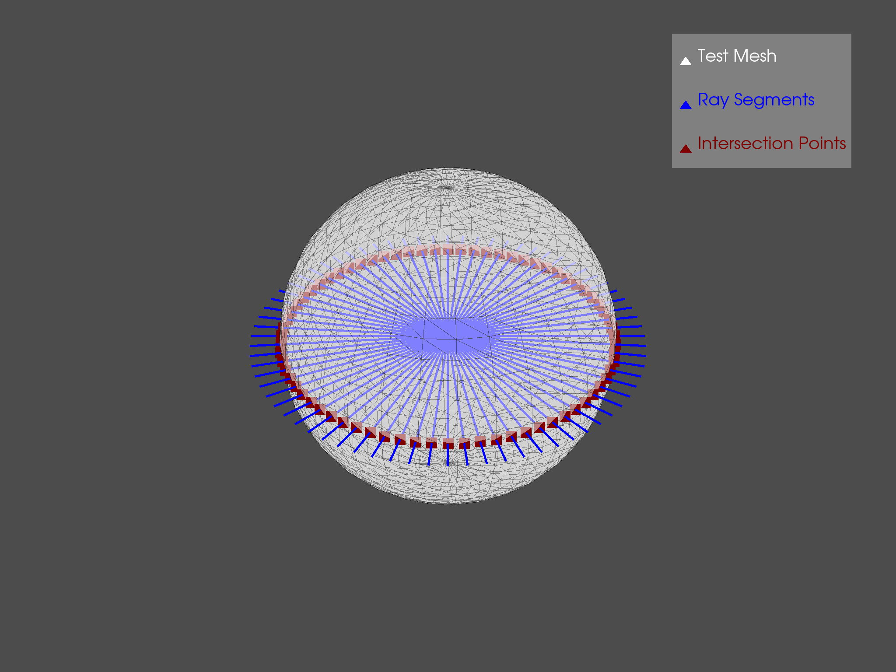
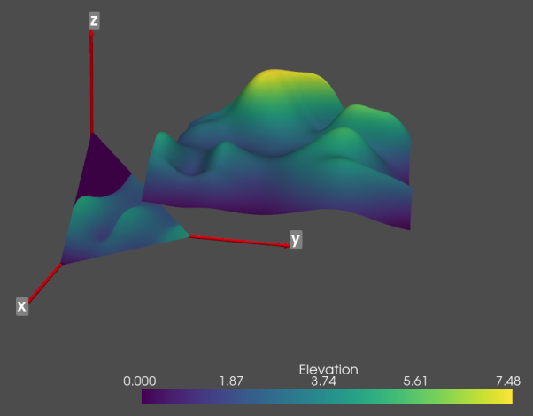

Optional Features
=================
Due to its usage of `numpy`, the `pyvista` module plays well with
other modules, including `matplotlib`, `trimesh`, `rtree`, and
`pyembree`.  The following examples show some optional features
included within `pyvista` that use or combine several modules to
perform advanced analyses not normally included within `VTK`.

Vectorised Ray Tracing
~~~~~~~~~~~~~~~~~~~~~~
Perform many ray traces simultaneously with a PolyData Object
(requires optional dependencies trimesh, rtree and pyembree)

.. code-block:: python

    from math import sin, cos, radians
    import pyvista as pv

    # Create source to ray trace
    sphere = pv.Sphere(radius=0.85)

    # Define a list of origin points and a list of direction vectors for each ray
    vectors = [ [cos(radians(x)), sin(radians(x)), 0] for x in range(0, 360, 5)]
    origins = [[0, 0, 0]] * len(vectors)

    # Perform ray trace
    points, ind_ray, ind_tri = sphere.multi_ray_trace(origins, vectors)

    # Create geometry to represent ray trace
    rays = [pv.Line(o, v) for o, v in zip(origins, vectors)]
    intersections = pv.PolyData(points)

    # Render the result
    p = pv.Plotter()
    p.add_mesh(sphere,
               show_edges=True, opacity=0.5, color="w",
               lighting=False, label="Test Mesh")
    p.add_mesh(rays[0], color="blue", line_width=5, label="Ray Segments")
    for ray in rays[1:]:
        p.add_mesh(ray, color="blue", line_width=5)
    p.add_mesh(intersections, color="maroon",
               point_size=25, label="Intersection Points")
    p.add_legend()
    p.show()

Project to Finite Plane
~~~~~~~~~~~~~~~~~~~~~~~
The following example expands on the vectorized ray tracing example by
projecting the random_hills example data to a triangular plane.

.. code-block:: python

    import numpy as np
    from pykdtree.kdtree import KDTree
    from tqdm import tqdm

    import pyvista as pv
    from pyvista import examples

    # Load data
    data = examples.load_random_hills()
    data.translate((10, 10, 10))

    # Create triangular plane (vertices [10, 0, 0], [0, 10, 0], [0, 0, 10])
    size = 10
    vertices = np.array([[size, 0, 0], [0, size, 0], [0, 0, size]])
    face = np.array([3, 0, 1, 2])

    planes = pv.PolyData(vertices, face)

    # Subdivide plane so we have multiple points to project to
    planes = planes.subdivide(8)

    # Get origins and normals
    origins = planes.cell_centers().points
    normals = planes.compute_normals(cell_normals=True, point_normals=False)["Normals"]

    # Vectorized Ray trace
    points, pt_inds, cell_inds = data.multi_ray_trace(
        origins, normals
    )  # Must have rtree, trimesh, and pyembree installed

    # Filter based on distance threshold, if desired (mimics VTK ray_trace behavior)
    # threshold = 10  # Some threshold distance
    # distances = np.linalg.norm(origins[inds] - points, ord=2, axis=1)
    # inds = inds[distances <= threshold]

    tree = KDTree(data.points.astype(np.double))
    _, data_inds = tree.query(points)

    elevations = data.point_data["Elevation"][data_inds]

    # Mask points on planes
    planes.cell_data["Elevation"] = np.zeros(planes.n_cells)
    planes.cell_data["Elevation"][pt_inds] = elevations

    # Create axes
    axis_length = 20
    tip_length = 0.25 / axis_length * 3
    tip_radius = 0.1 / axis_length * 3
    shaft_radius = 0.05 / axis_length * 3
    x_axis = pv.Arrow(
        direction=(axis_length, 0, 0),
        tip_length=tip_length,
        tip_radius=tip_radius,
        shaft_radius=shaft_radius,
        scale="auto",
    )
    y_axis = pv.Arrow(
        direction=(0, axis_length, 0),
        tip_length=tip_length,
        tip_radius=tip_radius,
        shaft_radius=shaft_radius,
        scale="auto",
    )
    z_axis = pv.Arrow(
        direction=(0, 0, axis_length),
        tip_length=tip_length,
        tip_radius=tip_radius,
        shaft_radius=shaft_radius,
        scale="auto",
    )
    x_label = pv.PolyData([axis_length, 0, 0])
    y_label = pv.PolyData([0, axis_length, 0])
    z_label = pv.PolyData([0, 0, axis_length])
    x_label.point_data["label"] = [
        "x",
    ]
    y_label.point_data["label"] = [
        "y",
    ]
    z_label.point_data["label"] = [
        "z",
    ]

    # Plot results
    p = pv.Plotter()
    p.add_mesh(x_axis, color="r")
    p.add_point_labels(x_label, "label", show_points=False, font_size=24)
    p.add_mesh(y_axis, color="r")
    p.add_point_labels(y_label, "label", show_points=False, font_size=24)
    p.add_mesh(z_axis, color="r")
    p.add_point_labels(z_label, "label", show_points=False, font_size=24)
    p.add_mesh(data)
    p.add_mesh(planes)
    p.show()

