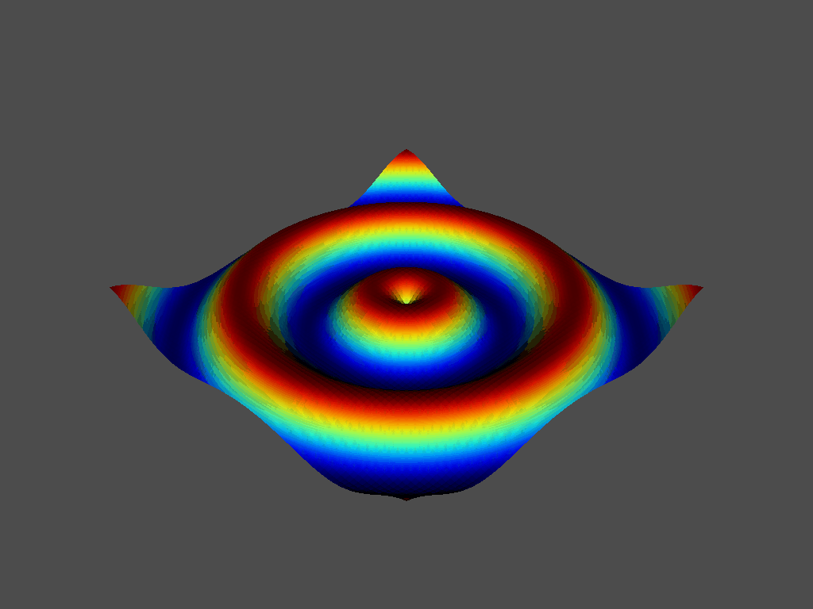

Quick Examples
==============
The following examples demonstrate the functionality of ``vtki``.

Loading and Plotting a Mesh from File
~~~~~~~~~~~~~~~~~~~~~~~~~~~~~~~~~~~~~
Loading a mesh is trivial.  The following code block uses a built-in example file and displays an airplane mesh.

.. code:: python

    import vtki
    from vtki import examples
    mesh = vtki.PolyData(examples.planefile)
    mesh.plot(color='orange')

.. image:: ./images/airplane.png

In fact, the code to generate the previous screenshot was created with:

.. code:: python

    mesh.plot(screenshot='airplane.png', color='orange')

You can also take a screenshot without creating an interactive plot window using the ``Plotter``:

.. code:: python

    plotter = vtki.Plotter(off_screen=True)
    plotter.add_mesh(mesh, color='orange')
    plotter.plot(auto_close=False)
    img = plotter.screenshot('airplane.png')
    plotter.close()

The ``img`` array can be used to plot the screenshot in ``matplotlib``:

.. code:: python

    import matplotlib.pyplot as plt
    plt.imshow(img)
    plt.show()

If you need to setup the camera you can do this by plotting first and getting the camera after running the ``plot`` function:

.. code:: python

    plotter = vtki.Plotter()
    plotter.add_mesh(mesh)
    cpos = plotter.plot()

You can then use this cached camera for additional plotting without having to manually interact with the ``vtk`` plot window:

.. code:: python

    plotter = vtki.Plotter(off_screen=True)
    plotter.add_mesh(mesh, color='orange')
    plotter.camera_position = cpos
    plotter.plot(auto_close=False)
    img = plotter.screenshot('airplane.png')
    plotter.close()

The points and faces from the mesh are directly accessible as a numpy array:

.. code:: python

    >>> print(mesh.points)

     [[ 896.99401855   48.76010132   82.26560211]
      [ 906.59301758   48.76010132   80.74520111]
      [ 907.53900146   55.49020004   83.65809631]
      ...,
      [ 806.66497803  627.36297607    5.11482   ]
      [ 806.66497803  654.43200684    7.51997995]
      [ 806.66497803  681.5369873     9.48744011]]

    >>> print(mesh.faces.reshape(-1, 4)[:, 1:])

     [[   0    1    2]
      [   0    2    3]
      [   4    5    1]
      ...,
      [1324 1333 1323]
      [1325 1216 1334]
      [1325 1334 1324]]

Creating a Structured Surface
~~~~~~~~~~~~~~~~~~~~~~~~~~~~~
This example creates a simple surface grid and plots the resulting grid and its curvature:

.. code:: python

    import vtki

    # Make data
    import numpy as np
    x = np.arange(-10, 10, 0.25)
    y = np.arange(-10, 10, 0.25)
    x, y = np.meshgrid(x, y)
    r = np.sqrt(x**2 + y**2)
    z = np.sin(r)

    # Create and plot structured grid
    grid = vtki.StructuredGrid(x, y, z)
    grid.plot()

    # Plot mean curvature as well
    grid.plot_curvature()

.. image:: ./images/curvature.png

Generating a structured grid is a one liner in this module, and the points from the resulting surface can be accessed as a numpy array:

.. code:: python

    >>> grid.points

     [[-10.         -10.           0.99998766]
      [ -9.75       -10.           0.98546793]
      [ -9.5        -10.           0.9413954 ]
      ...,
      [  9.25         9.75         0.76645876]
      [  9.5          9.75         0.86571785]
      [  9.75         9.75         0.93985707]]

Creating a GIF Movie
~~~~~~~~~~~~~~~~~~~~
This example shows the versatility of the plotting object by generating a moving gif:

.. code:: python

    import vtki
    import numpy as np

    x = np.arange(-10, 10, 0.25)
    y = np.arange(-10, 10, 0.25)
    x, y = np.meshgrid(x, y)
    r = np.sqrt(x**2 + y**2)
    z = np.sin(r)

    # Create and structured surface
    grid = vtki.StructuredGrid(x, y, z)

    # Creat a plotter object and set the scalars to the Z height
    plotter = vtki.Plotter()
    plotter.add_mesh(grid, scalars=z.ravel())

    # setup camera and close
    plotter.plot(auto_close=False)

    # Open a gif
    plotter.open_gif('wave.gif')

    pts = grid.points.copy()

    # Update Z and write a frame for each updated position
    nframe = 15
    for phase in np.linspace(0, 2*np.pi, nframe + 1)[:nframe]:
        z = np.sin(r + phase)
        pts[:, -1] = z.ravel()
        plotter.update_coordinates(pts)
        plotter.update_scalars(z.ravel())
        plotter.write_frame()

    # Close movie and delete object
    plotter.close()

Plotting in a Jupyter Notebook
~~~~~~~~~~~~~~~~~~~~~~~~~~~~~~
Inline plots are possible using a Jupyter notebook.  THe code snippet below
will create a static screenshot of the rendering and display it in the Jupyter
notebook:

.. code:: python

    import vtki
    sphere = vtki.Sphere()

    # short example
    cpos, image = sphere.plot(notebook=True)

    # long example
    plotter = vtki.Plotter(notebook=True)
    plotter.add_mesh(sphere)
    plotter.plot()

.. figure:: ./images/notebook_sphere.png
    :width: 600pt

    Jupyter Inline Plotting

To display interactive plots in Jupyter notebooks, use the
:class:`vtki.BackgroundPlotter` to open a rendering window in the background
that you can manipulate in real time from the Jupyter notebook:

.. code-block:: python

    import vtki
    from vtki import examples

    dataset = examples.load_uniform()

    plotter = vtki.BackgroundPlotter()
    plotter.add_mesh(dataset)

    # Then in another cell, you can add more to the plotter
    plotter.add_bounds_axes()

IPython Interactive Plotting Tools
----------------------------------

``vtki`` comes packed with several interactive plotting tools to make using the
filters a bit more intuitive (see :ref:`ipy_tools_ref`).
If in an IPython environment, call one of the tools on an input dataset to yield
widgets that will control a filter or task in an interactive rendering scene:

.. code:: python

   import vtki
   from vtki import examples

   dataset = examples.load_hexbeam()

   # Use the slicer tool
   vtki.OrthogonalSlicer(dataset)

.. figure:: https://github.com/akaszynski/vtki/raw/master/docs/images/slicer-tool.gif
  :width: 500pt

Clearing a Mesh or the Entire Plot
~~~~~~~~~~~~~~~~~~~~~~~~~~~~~~~~~~
Removing a single actor:

.. code:: python

    plotter = vtki.Plotter(notebook=True)
    actor = plotter.add_mesh(sphere)
    plotter.remove_actor(actor)
    plotter.plot()

Clearing the entire plotting window:

.. code:: python

    plotter = vtki.Plotter(notebook=True)
    plotter.add_mesh(vtki.Sphere())
    plotter.add_mesh(vtki.Plane())
    plotter.clear()  # clears all actors
    plotter.plot()

Using Common Filters
~~~~~~~~~~~~~~~~~~~~

``vtki`` wrapped data objects have a suite of common filters ready for immediate
use directly on the object (see :ref:`filters_ref`). These filters include:

* ``slice``: creates a single slice through the input dataset on a user defined plane
* ``slice_orthogonal``: creates a ``MultiBlock`` dataset of three orthogonal slices
* ``slice_along_axis``: creates a ``MultiBlock`` dataset of many slices along a specified axis
* ``threshold``: Thresholds a dataset by a single value or range of values
* ``threshold_percent``: Threshold by percentages of the scalar range
* ``clip``: Clips the dataset by a user defined plane
* ``outline_corners``: Outlines the corners of the data extent
* ``extract_geometry``: Extract surface geometry

To use these filter, call the method of your choice directly on your data object:

.. code:: python

    from vtki import examples

    dataset = examples.load_uniform()

    # Apply a threshold over a data range
    result = dataset.threshold([300, 500])
