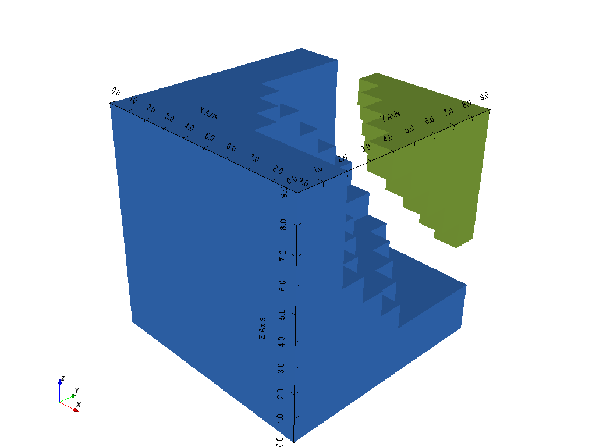
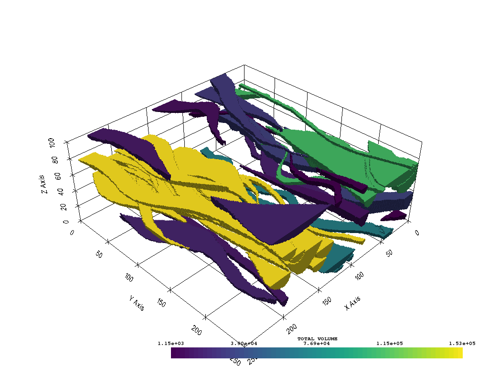

Volumetric Analysis
-------------------

Calculating mass properties such as the volume or area of datasets in ``vtki``
is quite easy using the :func:`vtki.DataSetFilters.compute_cell_sizes` filter
and the :attr:`vtki.Common.volume` property on all ``vtki`` meshes.

Let's get started with a simple gridded mesh:

.. testcode:: python

    import numpy as np
    import vtki
    from vtki import examples

    # Load a simple example mesh
    dataset = examples.load_uniform()
    dataset.set_active_scalar('Spatial Cell Data')

We can then calculate the volume of every cell in the array using the
``.compute_cell_sizes`` filter which will add arrays to the cell data of the
mesh core the volume and area by default.

.. testcode:: python

    # Compute volumes and areas
    sized = dataset.compute_cell_sizes()

    # Grab volumes for all cells in the mesh
    cell_volumes = sized.cell_arrays['Volume']

We can also compute the total volume of the mesh using the ``.volume`` property:

.. testcode:: python

    # Compute the total volume of the mesh
    volume = dataset.volume

Okay awesome! But what if we have have a dataset that we threshold with two
volumetric bodies left over in one dataset? Take this for example:

.. testcode:: python

    threshed = dataset.threshold_percent([0.15, 0.50], invert=True)
    threshed.plot(show_bounds=True, cpos=[-2,5,3], screenshot='./images/two-bodies.png')

.. image:: ../../../images/two-bodies.png

We could then assign a classification array for the two bodies, compute the
cell sizes, then extract the volumes of each body:

.. testcode:: python

    # Create a classifying array to ID each body
    rng = dataset.get_data_range()
    cval = ((rng[1] -rng[0]) * 0.20) + rng[0]
    classifier = threshed.cell_arrays['Spatial Cell Data'] > cval

    # Compute cell volumes
    sizes = threshed.compute_cell_sizes()
    volumes = sizes.cell_arrays['Volume']

    # Split volumes based on classifier and get volumes!
    idx = np.argwhere(classifier)
    hvol = np.sum(volumes[idx])
    idx = np.argwhere(~classifier)
    lvol = np.sum(volumes[idx])

    print('Low grade volume: {}'.format(lvol))
    print('High grade volume: {}'.format(hvol))
    print('Original volume: {}'.format(dataset.volume))

.. testoutput:: python
   :hide:
   :options: -ELLIPSIS, +NORMALIZE_WHITESPACE

    Low grade volume: 518.0
    High grade volume: 35.0
    Original volume: 729.0

Splitting Volumes
~~~~~~~~~~~~~~~~~

What if instead, we wanted to split all the different connected bodies/volumes
in a dataset like the one above? We could use the
:func:`vtki.DataSetFilters.split_bodies` filter to extract all the different
connected volumes in a dataset into blocks in a :class:`vtki.MultiBlock`
dataset. For example, lets split the thresholded volume in the example above:

.. testcode:: python

    import numpy as np
    import vtki
    from vtki import examples

    # Load a simple example mesh
    dataset = examples.load_uniform()
    dataset.set_active_scalar('Spatial Cell Data')
    threshed = dataset.threshold_percent([0.15, 0.50], invert=True)

    bodies = threshed.split_bodies()

    for i, body in enumerate(bodies):
        print('Body {} volume: {:.3f}'.format(i, body.volume))

.. testoutput:: python
   :hide:
   :options: -ELLIPSIS, +NORMALIZE_WHITESPACE

    Body 0 volume: 518.000
    Body 1 volume: 35.000

.. testcode:: python

    bodies.plot(show_bounds=True, multi_colors=True, cpos=[-2,5,3], screenshot='./images/split-bodies.png')

A Real Dataset
~~~~~~~~~~~~~~

Here is a realistic training dataset of fluvial channels in the subsurface.
This will threshold the channels from the dataset then separate each
significantly large body and compute the volumes for each!

Load up the data and threshold the channels:

.. testcode:: python

    import vtki
    from vtki import examples
    import numpy as np

    data = examples.load_channels()
    channels = data.threshold([0.9, 1.1])

Now extract all the different bodies and compute their volumes:

.. testcode:: python

    bodies = channels.split_bodies()
    # Now remove all bodies with a small volume
    for key in bodies.keys():
        b = bodies[key]
        vol = b.volume
        if vol < 1000.0:
            del bodies[key]
            continue
        # Now lets add a volume array to all blocks
        b.cell_arrays['TOTAL VOLUME'] = np.full(b.n_cells, vol)

Print out the volumes for each body:

.. code-block:: python

    for i, body in enumerate(bodies):
        print('Body {:02d} volume: {:.3f}'.format(i, body.volume))

And visualize all the different volumes:

.. testcode:: python

    p = vtki.Plotter()
    p.add_mesh(bodies, scalars='TOTAL VOLUME', cmap='viridis')
    p.show_grid()
    p.show(screenshot='./images/channel-volumes.png')

