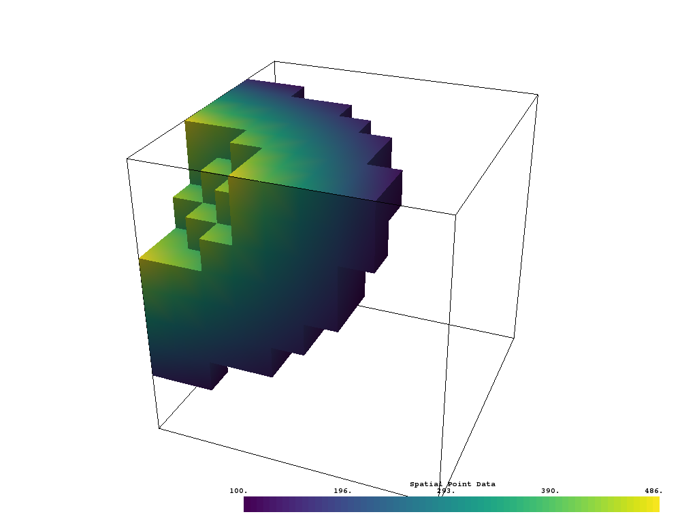

Using Common Filters
--------------------

``vtki`` wrapped data objects have a suite of common filters ready for immediate
use directly on the object. These filters include the following
(see :ref:`filters_ref` for a complete list):

* ``slice``: creates a single slice through the input dataset on a user defined plane
* ``slice_orthogonal``: creates a ``MultiBlock`` dataset of three orthogonal slices
* ``slice_along_axis``: creates a ``MultiBlock`` dataset of many slices along a specified axis
* ``threshold``: Thresholds a dataset by a single value or range of values
* ``threshold_percent``: Threshold by percentages of the scalar range
* ``clip``: Clips the dataset by a user defined plane
* ``outline_corners``: Outlines the corners of the data extent
* ``extract_geometry``: Extract surface geometry

To use these filters, call the method of your choice directly on your data
object:

.. testcode:: python

    import vtki
    from vtki import examples

    dataset = examples.load_uniform()

    # Apply a threshold over a data range
    result = dataset.threshold([100, 500])

.. testcode:: python

    p = vtki.Plotter()
    p.add_mesh(dataset.outline(), color='k')
    p.add_mesh(result)
    p.camera_position = [-2,5,3]
    p.show(screenshot='./images/threshold.png')

And now there is a thresholded version of the input dataset in the new
``result`` object. To learn more about what keyword arguments are available to
alter how filters are executed, print the docstring for any filter attached to
``vtki`` objects with either ``help(dataset.threshold)`` or using ``shift+tab``
in an IPython environment.

Filter Pipeline
---------------

In VTK, filters are often used in a pipeline where each algorithm passes its
output to the next filtering algorithm. In ``vtki``, we can mimic the filtering
pipeline through a chain; attaching each filter to the last filter.
In the following example, several filters are chained together:

1. First, and empty ``threshold`` filter to clean out any ``NaN`` values.
2. Use an ``elevation`` filter to generate scalar values corresponding to height.
3. Use the ``clip`` filter to cut the dataset in half.
4. Create three slices along each axial plane using the ``slice_orthogonal`` filter.

.. testcode:: python

    # Apply a filtering chain
    result = dataset.threshold().elevation().clip(normal='z').slice_orthogonal()

And to view this filtered data, simply call the ``plot`` method
(``result.plot()``) or create a rendering scene:

.. testcode:: python

    p = vtki.Plotter()
    p.add_mesh(dataset.outline(), color='k')
    p.add_mesh(result, scalars='Elevation')
    p.view_isometric()
    p.show(screenshot='./images/filter-chain.png')

.. image:: ../../../images/filter-chain.png
