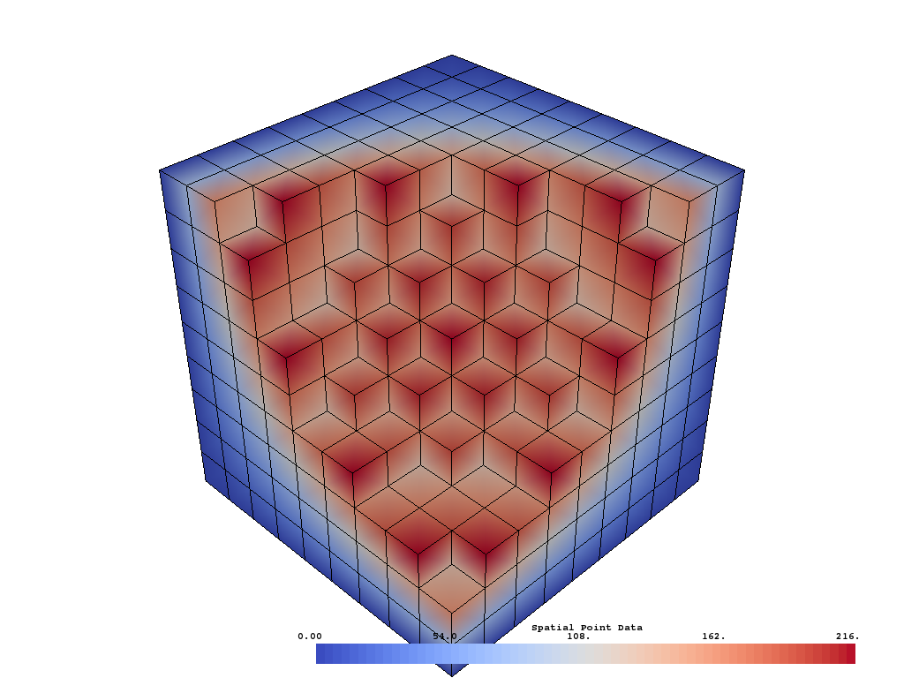
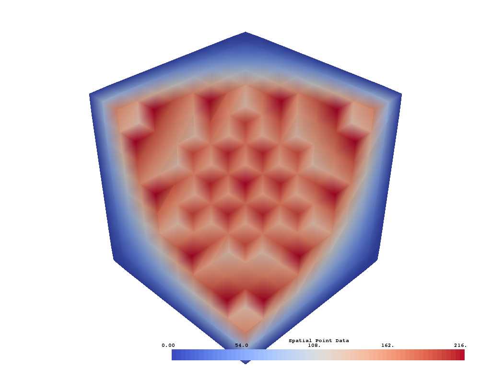
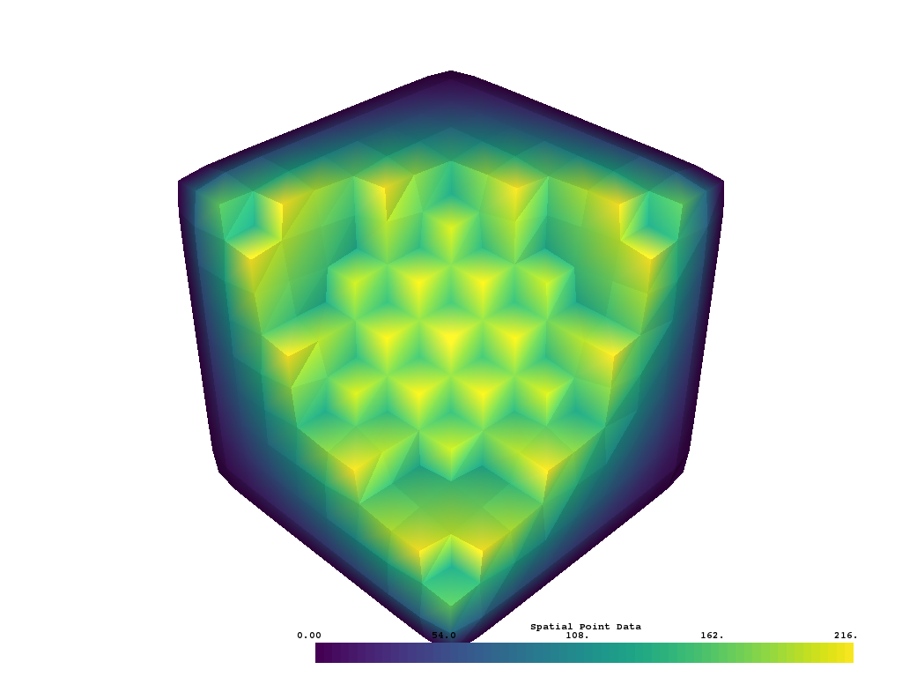
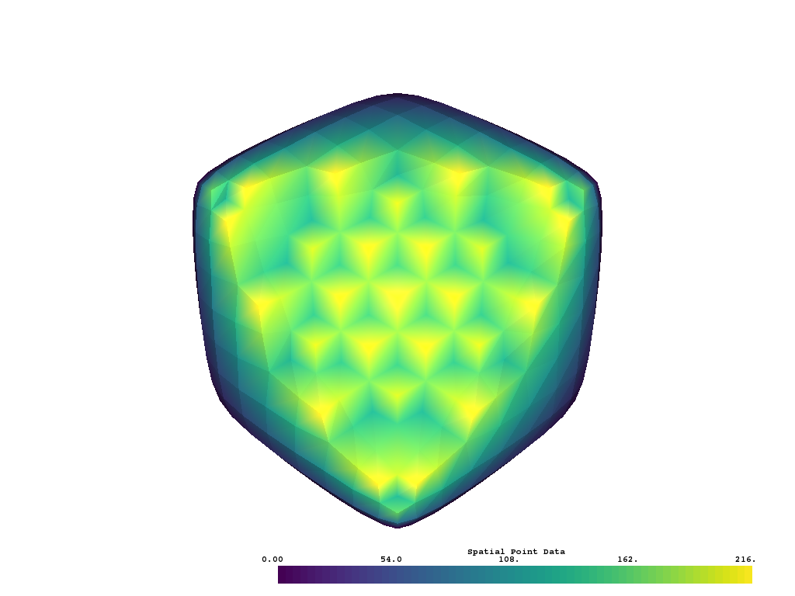

Volume Smoothing
----------------

Suppose you extract a volumetric subset of a dataset that has roughly defined
edges. Perhaps you'd like a smooth representation of that model region. This
can be achieved by extracting the bounding surface of the volume and applying
a :func:`vtki.PolyData.smooth` filter.

The below code snippet loads a sample  roughly edged volumetric dataset:

.. testcode:: python

    import vtki
    from vtki import examples

    # Vector to view rough edges
    cpos = [-2,5,3]

    # Load dataset
    data = examples.load_uniform()
    # Extract a rugged volume
    vol = data.threshold_percent(30, invert=1)
    vol.plot(show_edges=True, cpos=cpos, screenshot='./images/vol-smooth-0.png')

Extract the outer surface of the volume using the
:func:`vtki.DataSetFilters.extract_geometry` filter and then apply the smoothing
filter:

.. testcode:: python

    # Get the out surface as PolyData
    surf = vol.extract_geometry()
    # Smooth the surface
    smooth = surf.smooth()
    smooth.plot(show_edges=True, cpos=cpos, screenshot='./images/vol-smooth-20.png')

Not smooth enough? Try increasing the number of iterations for the laplacian
smoothing algorithm:

.. testcode:: python

    # Smooth the surface even more
    smooth = surf.smooth(n_iter=100)
    smooth.plot(show_edges=True, cpos=cpos, screenshot='./images/vol-smooth-100.png')

Still not smooth enough? Increase the number of iterations for the laplacian
smoothing algorithm to a crazy high value:

.. testcode:: python

    # Smooth the surface EVEN MORE
    smooth = surf.smooth(n_iter=1000)
    smooth.plot(show_edges=True, cpos=cpos, screenshot='./images/vol-smooth-1000.png')

