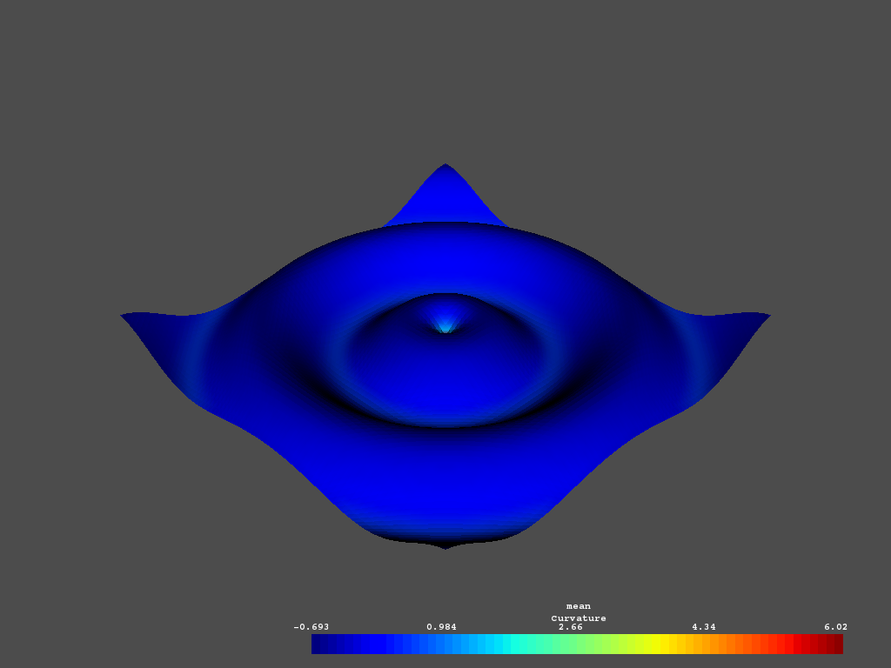

Creating a Structured Surface
-----------------------------

This example creates a simple surface grid and plots the resulting grid and its
curvature:

.. testcode:: python

    import vtki
    import numpy as np

    # Make data
    x = np.arange(-10, 10, 0.25)
    y = np.arange(-10, 10, 0.25)
    x, y = np.meshgrid(x, y)
    r = np.sqrt(x**2 + y**2)
    z = np.sin(r)

    # Create and plot structured grid
    grid = vtki.StructuredGrid(x, y, z)
    grid.plot()

    # Plot mean curvature as well
    grid.plot_curvature(screenshot='./images/curvature.png', clim=[-1, 1])

Generating a structured grid is a one liner in this module, and the points from
the resulting surface can be accessed as a NumPy array:

.. code:: python

    >>> grid.points

     [[-10.         -10.           0.99998766]
      [ -9.75       -10.           0.98546793]
      [ -9.5        -10.           0.9413954 ]
      ...,
      [  9.25         9.75         0.76645876]
      [  9.5          9.75         0.86571785]
      [  9.75         9.75         0.93985707]]
