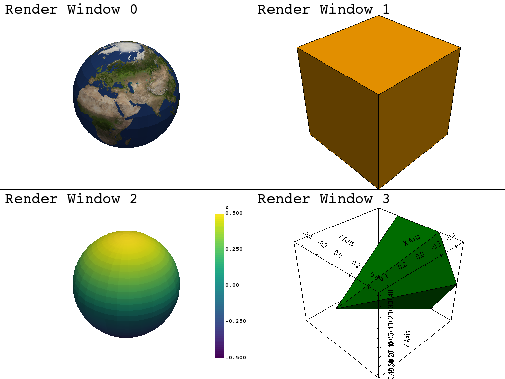

Multi-Window Plot
=================

This example shows how to create a multi-window plotter by specifying the ``shape`` parameter.  The window generated is a two by two window by setting ``shape=(2, 2)``.

.. code-block:: python

    import vtki
    from vtki import examples

    plotter = vtki.Plotter(shape=(2, 2))

    loc = (0, 0)
    plotter.add_text('Render Window 0', position=None, loc=loc, font_size=30)
    plotter.add_mesh(examples.load_globe(), loc=loc)

    loc = (0, 1)
    plotter.add_text('Render Window 1', loc=loc, font_size=30)
    plotter.add_mesh(vtki.Cube(), loc=loc, show_edges=True)

    loc = (1, 0)
    plotter.add_text('Render Window 2', loc=loc, font_size=30)
    sphere = vtki.Sphere()
    plotter.add_mesh(sphere, loc=loc, scalars=sphere.points[:, 2])
    plotter.add_scalar_bar('Z', vertical=True)
    # plotter.add_axes()
    plotter.add_axes(interactive=True)

    loc = (1, 1)
    plotter.add_text('Render Window 3', loc=loc, font_size=30)
    plotter.add_mesh(vtki.Cone(), color='g', loc=loc, show_edges=True)
    plotter.add_bounds_axes(all_edges=True)
    plotter.plot()

