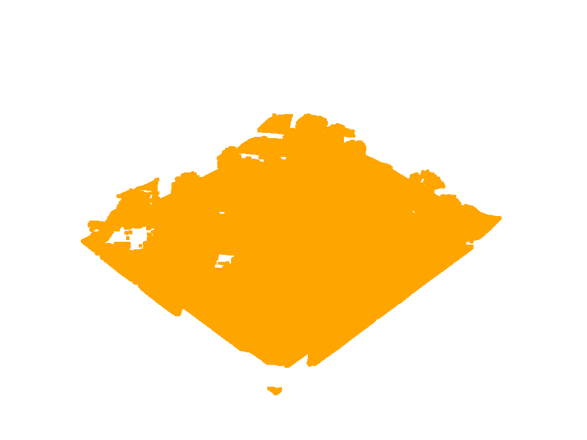
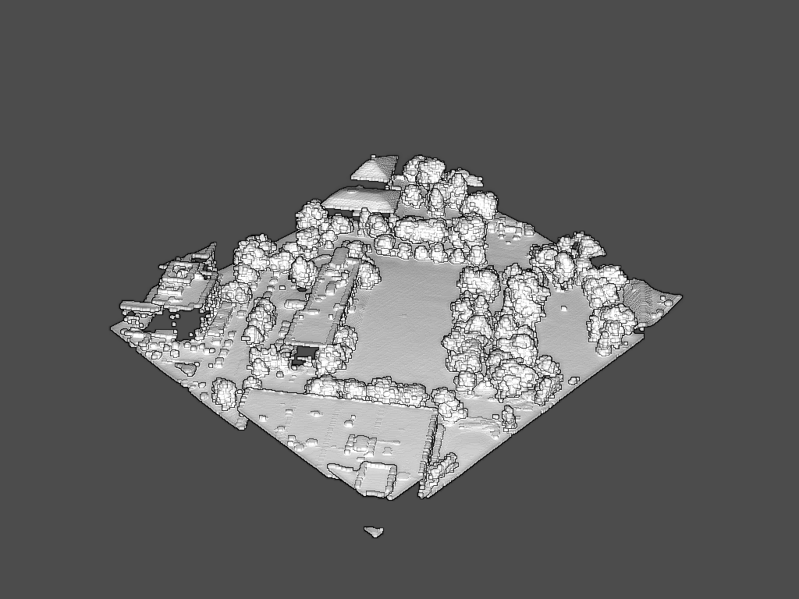
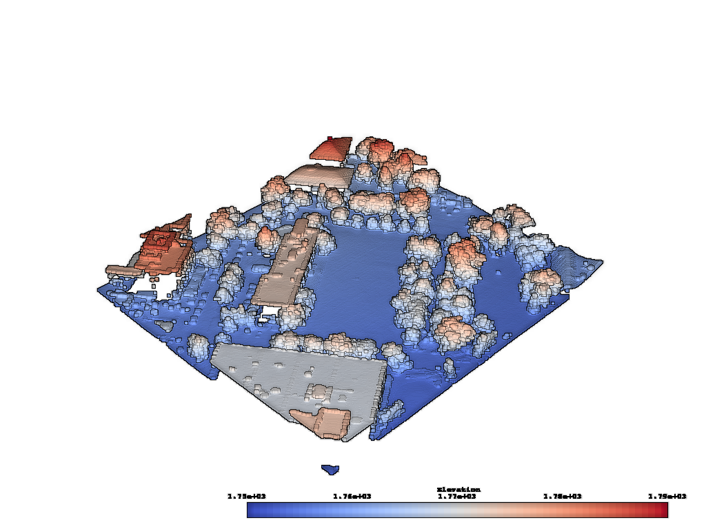

Plot Eye Dome Lighting
----------------------

Eye-Dome Lighting (EDL) is a non-photorealistic, image-based shading technique
designed to improve depth perception in scientific visualization images.
To learn more, please see `this blog post`_.

.. _this blog post: https://blog.kitware.com/eye-dome-lighting-a-non-photorealistic-shading-technique/

When plotting a simple point cloud, it can be difficult to perceive depth.
Take this Lidar point cloud for example:

.. testcode:: python

    import vtki
    from vtki import examples

    # Load a sample point cloud.
    point_cloud = examples.download_lidar()

And now plot this point cloud as-is:

.. testcode:: python

    # Plot a typical point cloud with no EDL
    p = vtki.Plotter()
    p.add_mesh(point_cloud, color='orange', point_size=5)
    p.show(screenshot='./images/point-cloud-no-edl.png')

We can improve the depth mapping by enabling eye dome lighting on the renderer.
Reference :func:`vtki.Renderer.eye_dome_lighting_on`.

.. testcode:: python

    # Plot with EDL
    p = vtki.Plotter()
    p.add_mesh(point_cloud, color='orange', point_size=5)
    p.eye_dome_lighting_on()
    p.show(screenshot='./images/point-cloud-edl.png')

The eye dome lighting mode can also handle plotting scalar arrays:

.. testcode:: python

    # Plot with EDL and scalar data
    p = vtki.Plotter()
    p.add_mesh(point_cloud, scalars='Elevation', point_size=5)
    p.eye_dome_lighting_on()
    p.show(screenshot='./images/point-cloud-edl-scalars.png')

