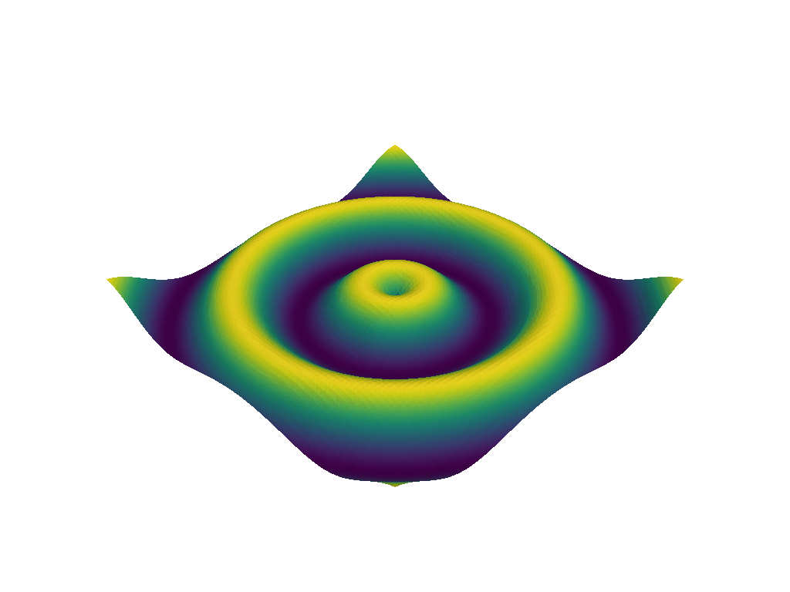

Creating a GIF Movie
--------------------

This example shows the versatility of the plotting object by generating a moving
gif:

.. testcode:: python

    import vtki
    import numpy as np

    x = np.arange(-10, 10, 0.25)
    y = np.arange(-10, 10, 0.25)
    x, y = np.meshgrid(x, y)
    r = np.sqrt(x**2 + y**2)
    z = np.sin(r)

    # Create and structured surface
    grid = vtki.StructuredGrid(x, y, z)

    # Creat a plotter object and set the scalars to the Z height
    plotter = vtki.Plotter()
    plotter.add_mesh(grid, scalars=z.ravel())

    # setup camera and close
    plotter.plot(auto_close=False)

    # Open a gif
    plotter.open_gif('./images/gifs/wave.gif')

    pts = grid.points.copy()

    # Update Z and write a frame for each updated position
    nframe = 15
    for phase in np.linspace(0, 2*np.pi, nframe + 1)[:nframe]:
        z = np.sin(r + phase)
        pts[:, -1] = z.ravel()
        plotter.update_coordinates(pts)
        plotter.update_scalars(z.ravel())
        plotter.write_frame()

    # Close movie and delete object
    plotter.close()

