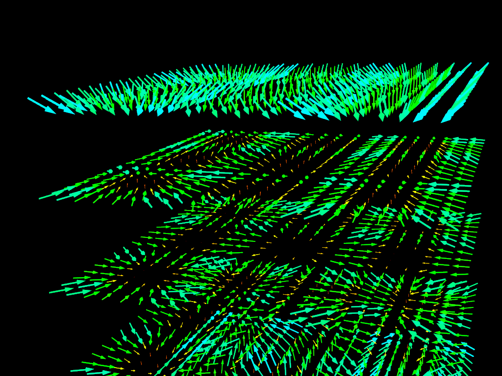
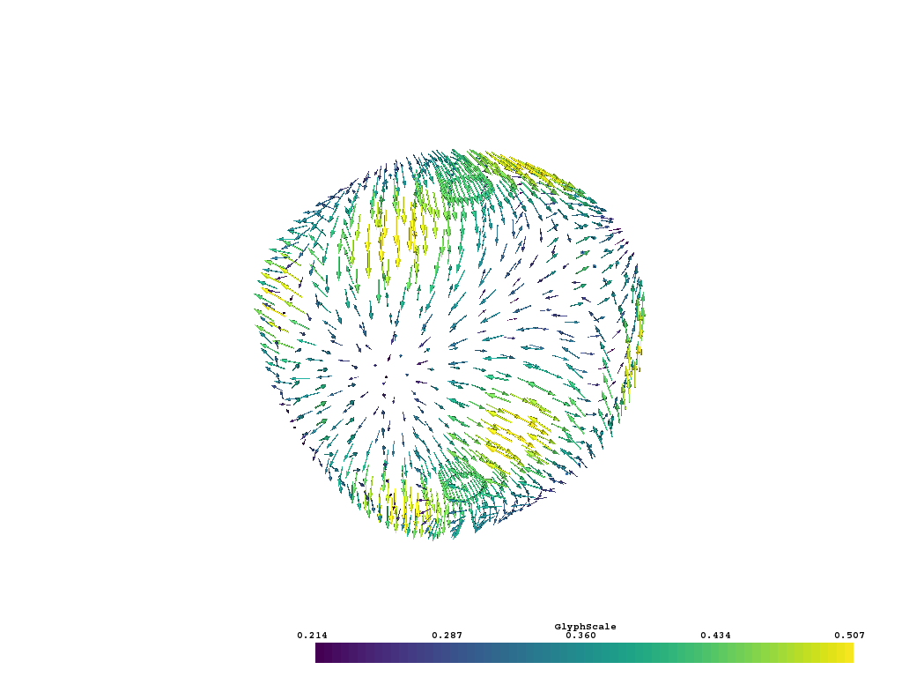
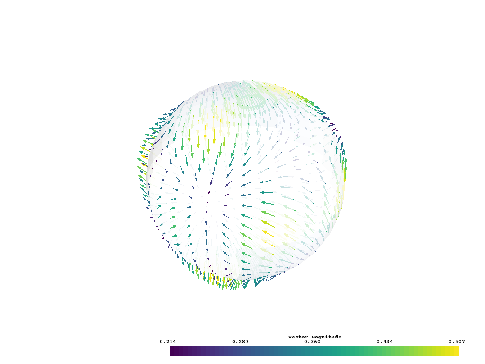

Plotting Glyphs
---------------

Using vectors in a dataset to plot and orient glyphs can be done via the
:func:`vtki.DataSetFilters.glyph` filter:

.. testcode:: python

    import vtki
    import numpy as np

    # Make a grid
    x, y, z = np.meshgrid(np.linspace(-5, 5, 20),
                      np.linspace(-5, 5, 20),
                      np.linspace(-5, 5, 5))

    grid = vtki.StructuredGrid(x, y, z)

    vectors = np.sin(grid.points)**3

    # Compute a direction for the vector field
    grid.point_arrays['mag'] = np.linalg.norm(vectors, axis=1)
    grid.point_arrays['vec'] = vectors

    # plot using the plotting class
    p = vtki.Plotter()
    p.add_mesh(grid.glyph(orient='vec', scale='mag', factor=1))
    p.show(auto_close=False)
    p.screenshot('./images/vectorfield.png')
    p.close()

Another approach is to load the vectors directly to the grid object and then access the :attr:`vtki.Common.arrows` property.

.. testcode:: python

    import vtki
    import numpy as np

    sphere = vtki.Sphere(radius=3.14)

    # make cool swirly pattern
    vectors = np.vstack((np.sin(sphere.points[:, 0]),
    np.cos(sphere.points[:, 1]),
    np.cos(sphere.points[:, 2]))).T

    # add and scale
    sphere.vectors = vectors*0.3

    # plot just the arrows
    sphere.arrows.plot(screenshot='./images/sphere_vectorfield.png')

    # plot the arrows and the sphere
    p = vtki.Plotter()
    p.add_mesh(sphere.arrows, lighting=False, stitle='Vector Magnitude')
    p.add_mesh(sphere, 'w', ambient=0.6, opacity=0.75, show_edges=False)
    p.show(screenshot='./images/sphere_vectorfield_w_sphere.png')

