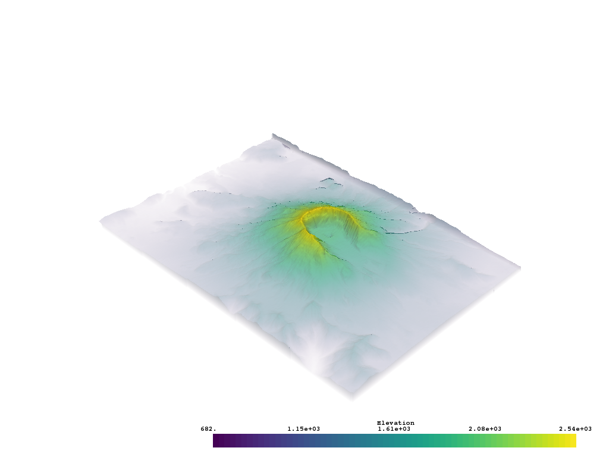

Plot with Opacity
-----------------

It's possible to apply an opacity mapping to any scalar array plotted. You can
specify either a single static value to make the mesh opaque on all cells, or
use a transfer function where the scalar array plotted is mapped to the opacity.

Opacity transfer function options are:

- ``'linear'``: linearly vary (increase) opacity across the plotted scalar range from low to high
- ``'linear_r'``: linearly vary (increase) opacity across the plotted scalar range from high to low
- ``'geom'``: on a log scale, vary (increase) opacity across the plotted scalar range from low to high
- ``'geom_r'``: on a log scale, vary (increase) opacity across the plotted scalar range from high to low

.. testcode:: python

    import vtki
    from vtki import examples

    # Load St Helens DEM and warp the topography
    mesh = examples.download_st_helens().warp_by_scalar()

    mesh.plot(opacity='linear', screenshot='opacity-linear.png')

