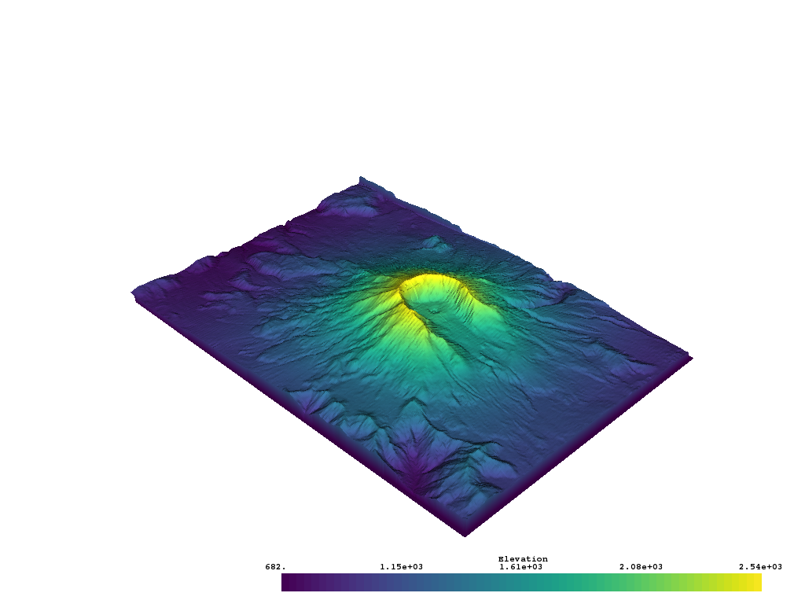
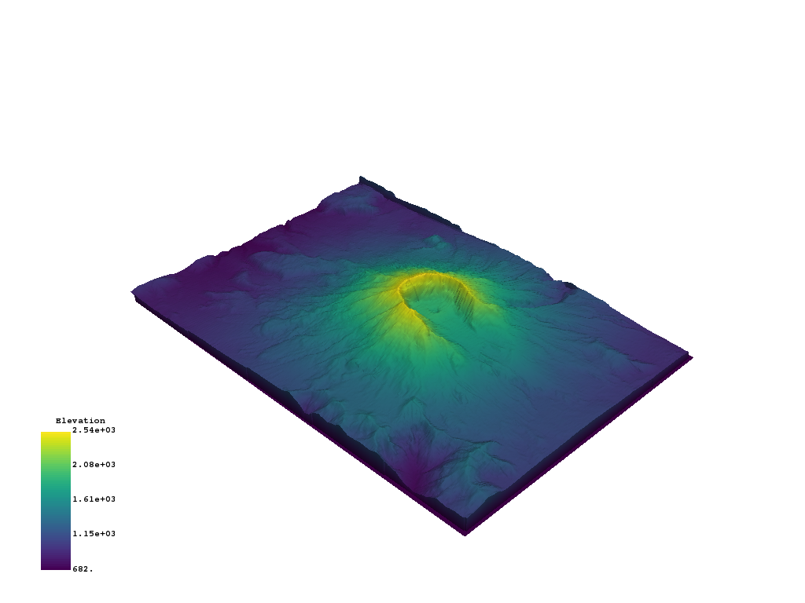
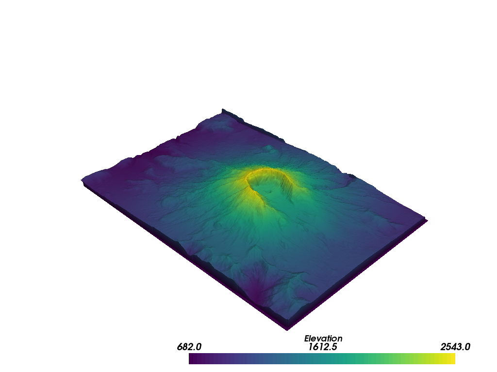

Plot Scalar Bars
----------------

This example provides a walk through of all the different interactive
capabilities of scalar bars and how a user can customize scalar bars.

By default, when plotting a dataset with a scalar array, a scalar bar for that
array is added. To turn off this behavior, a user could specify
``show_scalar_bar=False`` when calling ``.add_mesh()``. Let's start with a
sample dataset provide via ``vtki`` to demonstrate the default behavior of
scalar bar plotting:

.. testcode:: python

    import vtki
    from vtki import examples

    # Load St Helens DEM and warp the topography
    mesh = examples.download_st_helens().warp_by_scalar()

    # First a default plot with jet colormap
    p = vtki.Plotter()
    # Add the data, use active scalar for coloring, and show the scalar bar
    p.add_mesh(mesh)
    # Display the scene
    p.show(screenshot='./images/st-helens.png')

-----

We could also plot the scene with an interactive scalar bar to move around and
place where we like by specifying passing keyword arguments to control the
scalar bar via the ``scalar_bar_args`` parameter in :func:`vtki.BasePlotter.add_mesh`.
The keyword arguments to control the scalar bar are defined in
:func:`vtki.BasePlotter.add_scalar_bar`.

.. code-block:: python

    # create dictionary of parameters to control scalar bar
    sargs = dict(interactive=True) # Simply make the bar interactive

    p = vtki.Plotter(notebook=False) # If in IPython, be sure to show the scene
    p.add_mesh(mesh, scalar_bar_args=sargs)
    p.show()

.. figure:: ../../../images/gifs/scalar-bar-interactive.gif

-----

Or manually define the scalar bar's location:

.. testcode:: python

    # Set a custom position and size
    sargs = dict(height=0.25, vertical=True,
                 position_x=0.05, position_y=0.05)

    p = vtki.Plotter()
    p.add_mesh(mesh, scalar_bar_args=sargs)
    p.show(screenshot='./images/scalar-bar-location.png')

-----

The text properties of the scalar bar can also be controlled:

.. testcode:: python

    # Controlling the text properties
    sargs = dict(title_font_size=20, label_font_size=16,
             shadow=True, n_labels=3, italic=True, fmt='%.1f',
             font_family='arial')

    p = vtki.Plotter()
    p.add_mesh(mesh, scalar_bar_args=sargs)
    p.show(screenshot='./images/scalar-bar-text.png')

