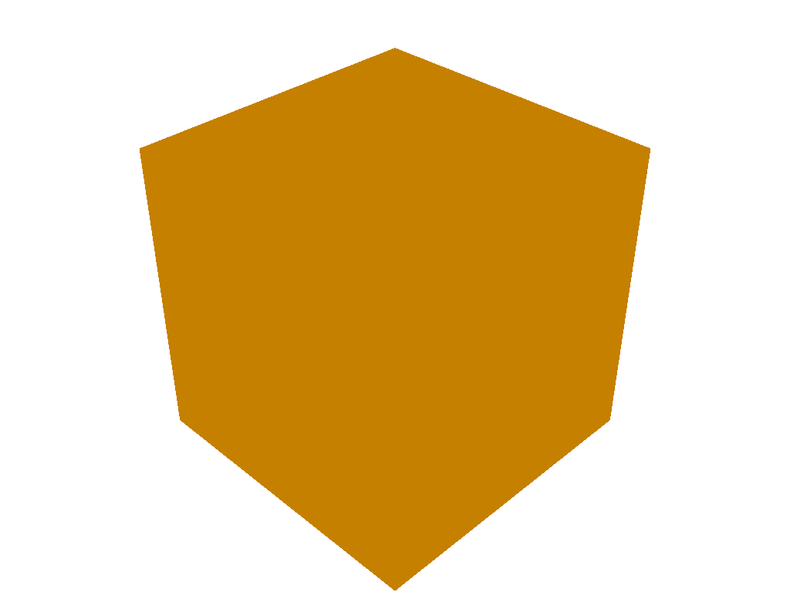
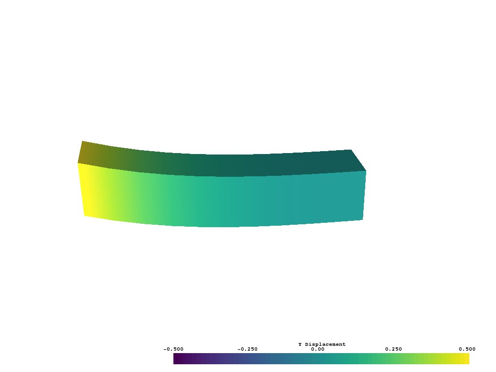
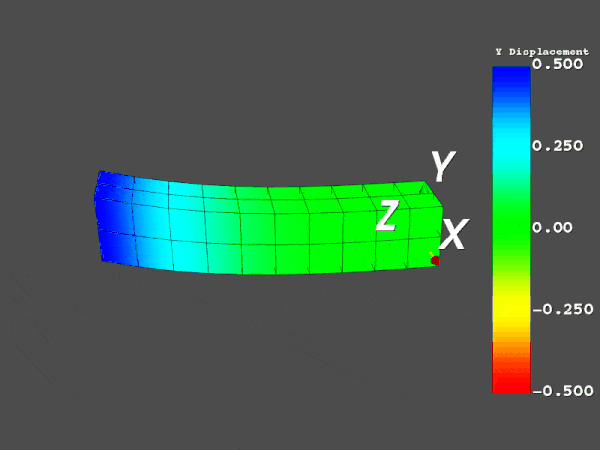
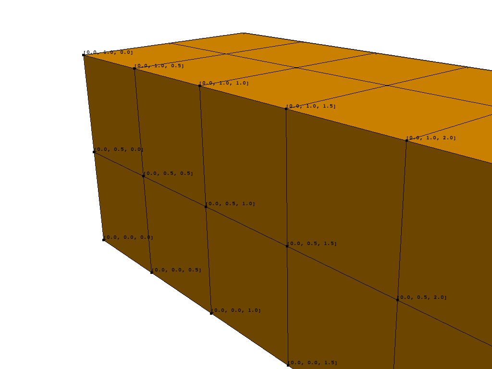
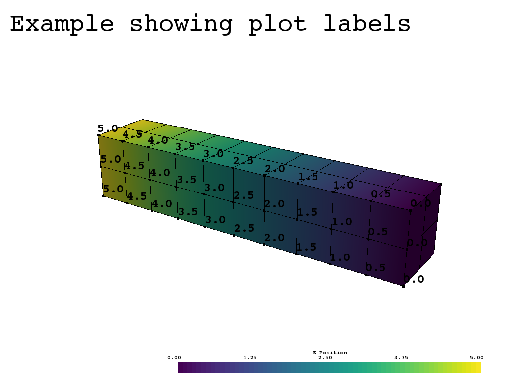

Structured and Unstructured Grids
=================================
Structured and unstructured grids are designed to manage cells whereas a polydata object manage surfaces.  The ``vtk.UnstructuredGrid`` is derived class from ``vtk.vtkUnstructuredGrid`` designed to make creation, array access, and plotting more straightforward than using the vtk object.  The same goes with a ``vtk.StructuredGrid``.

Unstructured Grid Creation
--------------------------

Empty Object
~~~~~~~~~~~~
An unstructured grid can be initialized with:

.. code:: python

    import vtki
    grid = vtki.UnstructuredGrid()

This creates an empty grid, and is not useful until points and cells are added to it.  VTK points and cells can be added with ``SetPoints`` and ``SetCells``, but the inputs to these need to be ``vtk.vtkCellArray`` and ``vtk.vtkPoints`` objects, which need to be populated with values.  Grid creation is simplified by initializing the grid directly from numpy arrays as in the following section.

Creating from Numpy Arrays
~~~~~~~~~~~~~~~~~~~~~~~~~~
An unstructured grid can be created directly from numpy arrays.  This is useful when creating a grid from scratch or copying it from another format.  See `vtkUnstructuredGrid <https://www.vtk.org/doc/nightly/html/classvtkUnstructuredGrid.html>`_ for available cell types and their descriptions.

.. code:: python

    import vtki
    import vtk

    # offset array.  Identifies the start of each cell in the cells array
    offset = np.array([0, 9])

    # Contains information on the points composing each cell.
    # Each cell begins with the number of points in the cell and then the points
    # composing the cell
    cells = np.array([8, 0, 1, 2, 3, 4, 5, 6, 7, 8, 8, 9, 10, 11, 12, 13, 14, 15])

    # cell type array. Contains the cell type of each cell
    cell_type = np.array([vtk.VTK_HEXAHEDRON, vtk.VTK_HEXAHEDRON])

    cell1 = np.array([[0, 0, 0],
                      [1, 0, 0],
                      [1, 1, 0],
                      [0, 1, 0],
                      [0, 0, 1],
                      [1, 0, 1],
                      [1, 1, 1],
                      [0, 1, 1]])

    cell2 = np.array([[0, 0, 2],
                      [1, 0, 2],
                      [1, 1, 2],
                      [0, 1, 2],
                      [0, 0, 3],
                      [1, 0, 3],
                      [1, 1, 3],
                      [0, 1, 3]])

    # points of the cell array
    points = np.vstack((cell1, cell2))

    # create the unstructured grid directly from the numpy arrays
    grid = vtki.UnstructuredGrid(offset, cells, cell_type, points)

    # plot the grid
    grid.plot()

..
   The resulting plot can be found in :numref:`twocubes`.

.. image:: ./images/twocubes.png

Loading from File
~~~~~~~~~~~~~~~~~
Unstructured grids can be loaded from a vtk file.

.. code:: python

    grid = vtki.UnstructuredGrid(filename)

Structured Grid Creation
------------------------

Empty Object
~~~~~~~~~~~~
A structured grid can be initialized with:

.. code:: python

    import vtki
    grid = vtki.StructuredGrid()

This creates an empty grid, and is not useful until points are added to it and the shape set using ``SetPoints`` and ``SetDimensions``.  This can be done with:

.. code:: python

    import numpy as np
    import vtki

    # create a cube of points
    x = np.arange(-10, 10, 0.25)
    y = np.arange(-10, 10, 0.25)
    z = np.arange(-10, 10, 0.25)
    x, y, z = np.meshgrid(x, y, z)

    # convert 
    points = np.empty((x.size, 3))
    points[:, 0] = x.ravel('F')
    points[:, 1] = y.ravel('F')
    points[:, 2] = z.ravel('F')

    # Create structured grid
    grid = vtki.StructuredGrid(x, y, z)
    grid.SetDimensions(x.shape)
    grid.SetPoints(vtki.vtk_points(points))

Creating from Numpy Arrays
~~~~~~~~~~~~~~~~~~~~~~~~~~
A structured grid can be created directly from numpy arrays.  This is useful when creating a grid from scratch or copying it from another format.

.. code:: python

    import vtki

    x = np.arange(-10, 10, 0.25)
    y = np.arange(-10, 10, 0.25)
    z = np.arange(-10, 10, 0.25)
    x, y, z = np.meshgrid(x, y, z)

    # create the unstructured grid directly from the numpy arrays and plot
    grid = vtki.StructuredGrid(x, y, z)
    grid.plot()

Loading from File
~~~~~~~~~~~~~~~~~
Structured grids can be loaded from a vtk file.

.. code:: python

    grid = vtki.StructuredGrid(filename)

Plotting Grids
--------------
This example shows how you can load an unstructured grid from a vtk file and create a plot and gif movie by updating the plotting object.

.. code:: python

    # Load module and example file
    import vtki
    from vtki import examples
    import numpy as np
    
    # Load example beam grid
    grid = vtki.UnstructuredGrid(examples.hexbeamfile)
    
    # Create fictitious displacements as a function of Z location
    d = np.zeros_like(grid.points)
    d[:, 1] = grid.points[:, 2]**3/250
    
    # Displace original grid
    grid.points += d

A simple plot can be created by using:

.. code:: python

    grid.plot(scalars=d[:, 1], stitle='Y Displacement')

A more complex plot can be created using:

.. code:: python

    # Store Camera position.  This can be obtained manually by getting the
    # output of grid.plot()
    # it's hard-coded in this example
    cpos = [(11.915126303095157, 6.11392754955802, 3.6124956735471914),
            (0.0, 0.375, 2.0),
            (-0.42546442225230097, 0.9024244135964158, -0.06789847673314177)]
    
    # plot this displaced beam
    plotter = vtki.Plotter()
    plotter.add_mesh(grid, scalars=d[:, 1], stitle='Y Displacement', 
                  rng=[-d.max(), d.max()])
    plotter.add_axes()
    plotter.camera_position(cpos)
    
    # Don't let it close automatically so we can take a screenshot
    cpos = plotter.plot(autoclose=False)
    plotter.screenshot('beam.png')
    plotter.close()

You can animate the motion of the beam by updating the positions and scalars of the grid copied to the plotting object.  First you have to setup the plotting object:

.. code:: python

    plotter = vtki.Plotter()
    plotter.add_mesh(grid, scalars=d[:, 1], stitle='Y Displacement', 
                  showedges=True, rng=[-d.max(), d.max()], 
                  interpolatebeforemap=True)
    plotter.add_axes()
    plotter.camera_position(cpos)
    
You then open the render window by plotting before opening movie file.  Set autoclose to False so the plotter does not close automatically.  Disabling interactive means the plot will automatically continue without waiting for the user to exit the window.

.. code:: python

    plotter.plot(interactive=False, autoclose=False, window_size=[800, 600])
    
    # open movie file.  A mp4 file can be written instead.  Requires moviepy
    plotter.open_gif('beam.gif')  # or beam.mp4
    
    # Modify position of the beam cyclically
    pts = grid.points.copy()  # unmodified points
    for phase in np.linspace(0, 2*np.pi, 20):
        plotter.update_coordinates(pts + d*np.cos(phase))
        plotter.update_scalars(d[:, 1]*np.cos(phase))
        plotter.write_frame()
    
    # Close the movie and plot
    plotter.close()
    

You can also render the beam as as a wire-frame object:

.. code:: python

    # Animate plot as a wire-frame
    plotter = vtki.Plotter()
    plotter.add_mesh(grid, scalars=d[:, 1], stitle='Y Displacement', showedges=True,
                  rng=[-d.max(), d.max()], interpolatebeforemap=True,
                  style='wireframe')
    plotter.AddAxes()
    plotter.SetCameraPosition(cpos)
    plotter.plot(interactive=False, autoclose=False, window_size=[800, 600])
    
    #plotter.OpenMovie('beam.mp4')
    plotter.OpenGif('beam_wireframe.gif')
    for phase in np.linspace(0, 2*np.pi, 20):
        plotter.UpdateCoordinates(pts + d*np.cos(phase), render=False)
        plotter.UpdateScalars(d[:, 1]*np.cos(phase), render=False)
        plotter.Render()
        plotter.WriteFrame()
    
    plotter.Close()
    
.. image:: ./images/beam_wireframe.gif

Adding Labels to a Plot
-----------------------
Labels can be added to a plot using the ``AddPointLabels`` function within the ``Plotter`` object.  The following example loads the included example beam, generates a plotting class, and sub-selects points along the y-z plane and labels their coordinates.  ``AddPointLabels`` requires that the number of labels matches the number of points, and that labels is a list containing one entry per point.  The code automatically converts each item in the list to a string.

.. code:: python

    # Load module and example file
    import vtki
    from vtki import examples

    # Load example beam file
    grid = vtki.UnstructuredGrid(examples.hexbeamfile)

    # Create plotting class and add the unstructured grid
    plotter = vtki.Plotter()
    plotter.add_mesh(grid)

    # Add labels to points on the yz plane (where x == 0)
    points = grid.GetNumpyPoints()
    mask = points[:, 0] == 0
    plotter.AddPointLabels(points[mask], points[mask].tolist())

    plotter.plot()

This example is similar and shows how labels can be combined with a scalar bar to show the exact value of certain points.

.. code:: python

    # Label the Z position
    values = grid.points[:, 2]

    # Create plotting class and add the unstructured grid
    plotter = vtki.Plotter()
    plotter.add_mesh(grid, scalars=values) # color mesh according to z value
    plotter.AddScalarBar(title='Z Position')

    # Add labels to points on the yz plane (where x == 0)
    mask = grid.points[:, 0] == 0
    plotter.AddPointLabels(points[mask], values[mask].tolist(), fontsize=24)

    # add some text to the plot
    plotter.AddText('Example showing plot labels')

    plotter.plot()

vtki.Unstructured Grid Class Methods
--------------------------------------------
The following is a description of the methods available to a ``vtki.UnstructuredGrid`` object.  It inherits all methods from the original vtk object, `vtk.vtkUnstructuredGrid <https://www.vtk.org/doc/nightly/html/classvtkUnstructuredGrid.html>`_.

.. autoclass:: vtki.UnstructuredGrid
    :members:

vtki.Structured Grid Class Methods
--------------------------------------------
The following is a description of the methods available to a ``vtki.StructuredGrid`` object.  It inherits all methods from the original vtk object, `vtk.vtkStructuredGrid <https://www.vtk.org/doc/nightly/html/classvtkStructuredGrid.html>`_.

.. autoclass:: vtki.StructuredGrid
    :members:

Methods in Common with Structured and Unstructured Grids
--------------------------------------------------------
These methods are in common to both ``vtki.StructuredGrid`` and ``vtki.UnstructuredGrid`` objects.

.. autoclass:: vtki.Grid
    :members:
