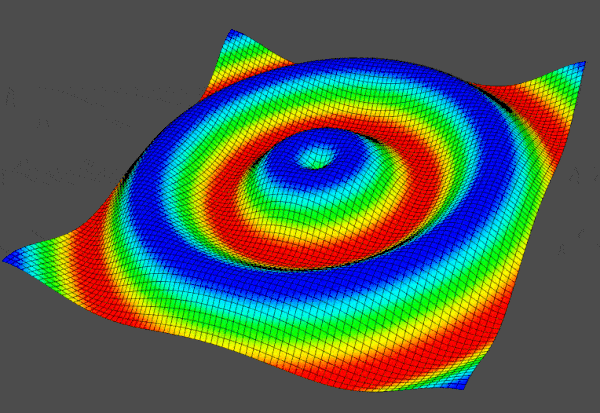

vtkInterface Overview
=====================

vtkInterface is a Python module that simplifies the interface with VTK by using numpy and direct array access and more general classes to work with meshes and plotting.

This moudle is suited creating engineering plots for presentations and research papers as well as being a supporting module for other mesh dependent Python modules that would like to simplify hundreds of lines of code into just a few lines.

Installation
------------

If you have a working copy of VTK, installation is simply::

    pip install vtkInterface
    
You can also visit `PyPi <http://pypi.python.org/pypi/vtkInterface>`_ or `GitHub <https://github.com/akaszynski/vtkInterface>`_ to download the source.

See the :ref:`install_ref` for more details.

Quick Examples
--------------

Loading and Plotting a Mesh from File
~~~~~~~~~~~~~~~~~~~~~~~~~~~~~~~~~~~~~

Loading a mesh is trivial.

.. code:: python

    import vtkInterface
    mesh = vtkInterface.LoadMesh('airplane.ply')
    mesh.Plot(color='orange')
    
.. image:: airplane.png

In fact, the code to generate the previous screenshot was created with:

.. code:: python

    mesh.Plot(screenshot='airplane.png', color='orange')

The points and faces from the mesh are directly accessible as a numpy array:

.. code:: python

    print mesh.GetNumpyPoints()
    
    #[[ 896.99401855   48.76010132   82.26560211]
    # [ 906.59301758   48.76010132   80.74520111]
    # [ 907.53900146   55.49020004   83.65809631]
    # ..., 
    # [ 806.66497803  627.36297607    5.11482   ]
    # [ 806.66497803  654.43200684    7.51997995]
    # [ 806.66497803  681.5369873     9.48744011]]
    
    print mesh.GetNumpyFaces()
    
    #[[   0    1    2]
    # [   0    2    3]
    # [   4    5    1]
    # ..., 
    # [1324 1333 1323]
    # [1325 1216 1334]
    # [1325 1334 1324]]
    
    
Creating a Structured Surface
~~~~~~~~~~~~~~~~~~~~~~~~~~~~~

This example creates a simple surface grid and plots the resulting grid and 
its curvature:

.. code:: python

    import vtkInterface

    # Make data
    import numpy as np
    X = np.arange(-10, 10, 0.25)
    Y = np.arange(-10, 10, 0.25)
    X, Y = np.meshgrid(X, Y)
    R = np.sqrt(X**2 + Y**2)
    Z = np.sin(R)
    
    # Create and plot structured grid
    sgrid = vtkInterface.GenStructSurf(X, Y, Z)
    sgrid.Plot()
    
    # Plot mean curvature as well
    surf.PlotCurvature()

.. image:: curvature.png

Generating a structured grid is a one liner in this module, and the points from
the resulting surface are also a numpy array:

.. code:: python

    surf.GetNumpyPoints()
    
    #[[-10.         -10.           0.99998766]
    # [ -9.75       -10.           0.98546793]
    # [ -9.5        -10.           0.9413954 ]
    # ..., 
    # [  9.25         9.75         0.76645876]
    # [  9.5          9.75         0.86571785]
    # [  9.75         9.75         0.93985707]]

Creating a GIF Movie
~~~~~~~~~~~~~~~~~~~~

This example shows the versatility of the plotting object by generating a 
moving gif:

.. code:: python
    
    import vtkInterface
    import numpy as np
    
    # Make data
    X = np.arange(-10, 10, 0.25)
    Y = np.arange(-10, 10, 0.25)
    X, Y = np.meshgrid(X, Y)
    R = np.sqrt(X**2 + Y**2)
    Z = np.sin(R)
    
    # Create and structured surface
    sgrid = vtkInterface.GenStructSurf(X, Y, Z)
    
    # Make deep copy of points
    pts = sgrid.GetNumpyPoints(deep=True)
    
    # Start a plotter object and set the scalars to the Z height
    plobj = vtkInterface.PlotClass()
    plobj.AddMesh(sgrid, scalars=Z.ravel())
    plobj.Plot(autoclose=False)
    
    # Open a gif
    plobj.OpenGif('wave.gif')
    
    # Update Z and write a frame for each updated position
    nframe = 15
    for phase in np.linspace(0, 2*np.pi, nframe + 1)[:nframe]:
        Z = np.sin(R + phase)
        pts[:, -1] = Z.ravel()
        plobj.UpdateCoordinates(pts)
        plobj.UpdateScalars(Z.ravel())
    
        plobj.WriteFrame()
    
    # Close movie and delete object
    plobj.Close()
    del plobj

Contents
========

.. toctree::
   :maxdepth: 2
   
   overview
   installation
   examples

Indices and tables
==================

* :ref:`genindex`
* :ref:`modindex`
* :ref:`search`
