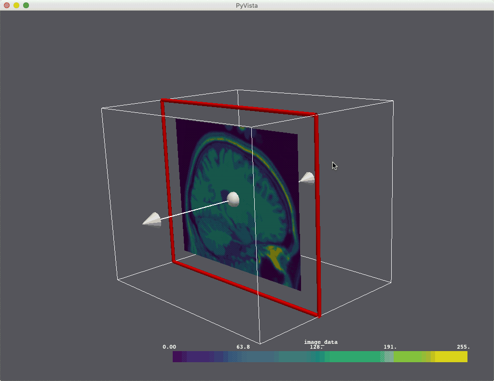
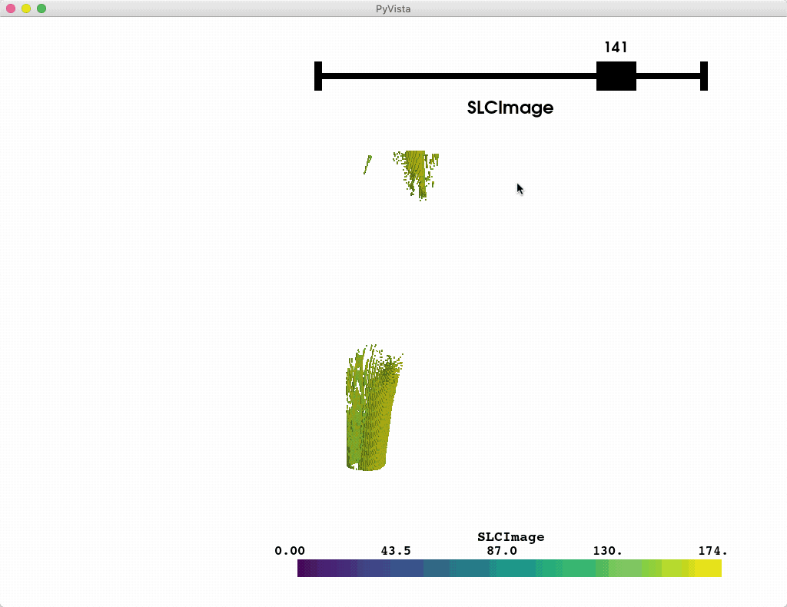
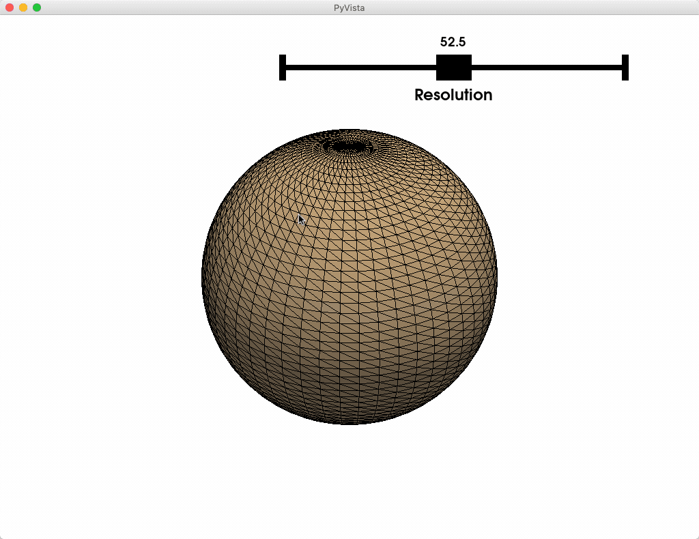

Widgets
-------

PyVista has several widgets that can be added to the rendering scene to control
filters like clipping, slicing, and thresholding - specifically there are
widgets to control the positions of boxes, planes, and lines or slider bars
which can all be highly customized through the use of custom callback
functions.

Here we'll take a look a the various widgets, some helper methods that leverage
those widgets to do common tasks, and demonstrate how to leverage the widgets
for user defined tasks and processing routines.

Box Widget
~~~~~~~~~~

The box widget can be enabled and disabled by the
:func:`pyvista.BasePlotter.enable_box_widget` and
:func:`pyvista.BasePlotter.disable_box_widget` methods respectively.
When enabling the box widget, you must provide a custom callback function
otherwise the box would appear and do nothing - the callback functions are
what allow us to leverage the widget to perfrom a task like clipping/cropping.

Considering that using a box to clip/crop a mesh is one of the most common use
cases, we have included a helper method that will allow you to add a mesh to a
scene with a box widget that controls its extent, the
:func:`pyvista.BasePlotter.add_mesh_clip_box` method.

.. code-block:: python

    import pyvista as pv
    from pyvista import examples

    mesh = examples.download_nefertiti()

    p = pv.Plotter(notebook=False)
    p.add_mesh_clip_box(mesh, color='white')
    p.show()

.. image:: ../images/gifs/box-clip.gif

Plane Widget
~~~~~~~~~~~~

The plane widget can be enabled and disabled by the
:func:`pyvista.BasePlotter.enable_plane_widget` and
:func:`pyvista.BasePlotter.disable_plane_widget` methods respectively.
As with all widgets, you must provide a custom callback method to utilize that
plane. Considering that planes are most commonly used for clipping and slicing
meshes, we have included two helper methods for doing those tasks!

Let's use a plane to clip a mesh:

.. code-block:: python

    import pyvista as pv
    from pyvista import examples

    vol = examples.download_brain()

    p = pv.Plotter(notebook=False)
    p.add_mesh_clip_plane(vol)
    p.show()

.. image:: ../images/gifs/plane-clip.gif

Or you could slice a mesh using the plane widget:

.. code-block:: python

    p = pv.Plotter(notebook=False)
    p.add_mesh_slice(vol)
    p.show()

Or you could leverage the plane widget for some custom task like glyphing a
vector field along that plane.

.. code-block:: python

    import pyvista as pv
    from pyvista import examples

    mesh = examples.download_carotid()

    p = pv.Plotter(notebook=False)
    p.add_mesh(mesh.contour(8).extract_largest(), opacity=0.5)

    def my_plane_func(normal, origin):
        slc = mesh.slice(normal=normal, origin=origin)
        arrows = slc.glyph(orient='vectors', scale="scalars", factor=0.01)
        p.add_mesh(arrows, name='arrows')

    p.enable_plane_widget(my_plane_func)
    p.show_grid()
    p.add_axes()
    p.show()

.. image:: ../images/gifs/plane-glyph.gif

Line Widget
~~~~~~~~~~~

The line widget can be enabled and disabled by the
:func:`pyvista.BasePlotter.enable_line_widget` and
:func:`pyvista.BasePlotter.disable_line_widget` methods respectively.
Unfortunately, PyVista does not have any helper methods to utilize this
widget, so it is necessary to pas a custom callback method.

One particularly fun example is to use the line widget to create source for
the :func:`pyvista.DataSetFilters.streamlines` filter.

.. code-block:: python

    import pyvista as pv
    from pyvista import examples
    import numpy as np

    pv.set_plot_theme('doc')

    mesh = examples.download_kitchen()
    furniture = examples.download_kitchen(split=True)

    arr = np.linalg.norm(mesh['velocity'], axis=1)
    clim = [arr.min(), arr.max()]

    p = pv.Plotter(notebook=False)
    p.add_mesh(furniture, name='furniture', color=True)
    p.add_mesh(mesh.outline(), color='black')
    p.add_axes()

    def simulate(pointa, pointb):
        streamlines = mesh.streamlines(n_points=10, max_steps=100,
                                       pointa=pointa, pointb=pointb,
                                       integration_direction='forward')
        p.add_mesh(streamlines, name='streamlines', line_width=5,
                   render_lines_as_tubes=True, clim=clim)

    p.enable_line_widget(callback=simulate, use_vertices=True)
    p.show()

.. image:: ../images/gifs/line-widget-streamlines.gif

Slider Bar Widget
~~~~~~~~~~~~~~~~~

The slider widget can be enabled and disabled by the
:func:`pyvista.BasePlotter.enable_slider_widget` and
:func:`pyvista.BasePlotter.disable_slider_widget` methods respectively.
This is one of the most versatile widgets as it can control a value that can
be used for just about anything.

One helper method we've add is the
:func:`pyvista.BasePlotter.add_mesh_threshold` method which leverages the
slider widget to control a thresholding value.

.. code-block:: python

    import pyvista as pv
    from pyvista import examples

    mesh = examples.download_knee_full()

    p = pv.Plotter(notebook=False)
    p.add_mesh_threshold(mesh)
    p.show()

Or you could leverage a custom callback function that takes a single value
from the slider as its argument to do something like control the resolution
of a mesh:

.. code-block:: python

    p = pv.Plotter(notebook=False)

    def create_mesh(value):
        res = int(value)
        sphere = pv.Sphere(phi_resolution=res, theta_resolution=res)
        p.add_mesh(sphere, name='sphere', show_edges=True)
        return

    p.enable_slider_widget(create_mesh, [5, 100], title='Resolution')
    p.show()

