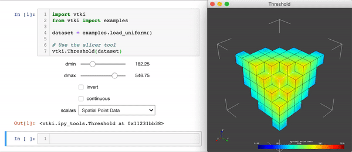
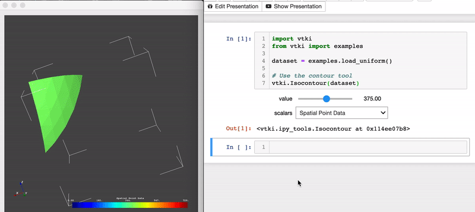

.. _ipy_tools_ref:

IPython Tools
=============

The IPython tools harness PyVista's Qt rendering interface that enables
accessible background plotting so that a rendering environment can be updated
in real-time from a Jupyter notebook or other IPython environment.

These tools are useable from the top level of PyVista on any PyVista wrapped
dataset. Simply call one of these tools on your object.

.. rubric:: Attributes

.. autoautosummary:: pyvista.ipy_tools.InteractiveTool
   :attributes:

.. rubric:: Methods

.. autoautosummary:: pyvista.ipy_tools.InteractiveTool
   :methods:

Orthogonal Slicer
-----------------

The :class:`pyvista.OrthogonalSlicer` tool on an example dataset to create three
slices on the cartesian planes and move those slices through the dataset using
slider bars directly in a Jupyter notebook:

.. code-block:: python

    import pyvista as pv
    from pyvista import examples

    dataset = examples.load_hexbeam()

    # Use the slicer tool
    pv.OrthogonalSlicer(dataset)

.. figure:: ../images/gifs/slicer-tool.gif
   :width: 500pt

.. autoclass:: pyvista.OrthogonalSlicer
   :show-inheritance:

Threshold
---------

The :class:`pyvista.Threshold` tool is used to interactively threshold a
dataset using slider bars for the minimum and maximum range. This tool also
has options to invert the threshold using checkboxes all directly in the output
of a Jupyter notebook cell:

.. code-block:: python

    import pyvista as pv
    from pyvista import examples

    dataset = examples.load_uniform()

    # Use the slicer tool
    pv.Threshold(dataset)

.. autoclass:: pyvista.Threshold
   :show-inheritance:

Many Slices Along Axis
----------------------

The :class:`pyvista.ManySlicesAlongAxis` tool is used to create many (``n``)
evenly spaced slices of a dataset along a specified axis. The user selects the
number of slices via a slider bar and the axis to slice against via a drop
down menu in the Jupyter notebook cell output:

.. code-block:: python

    import pyvista as pv
    from pyvista import examples

    dataset = examples.load_uniform()

    # Use the many slices tool
    pv.ManySlicesAlongAxis(dataset)

.. figure:: ../images/gifs/many-slices-tool.gif
   :width: 500pt

.. autoclass:: pyvista.ManySlicesAlongAxis
   :show-inheritance:

Isocontour
----------

The :class:`pyvista.Isocontour` tool creates a single value isocontour of a dataset
along a point scalar array

.. code-block:: python

    import pyvista as pv
    from pyvista import examples

    dataset = examples.load_uniform()

    # Use the contour tool
    pv.Isocontour(dataset)

.. autoclass:: pyvista.ManySlicesAlongAxis
   :show-inheritance:

Using the Tools in an Integrated Scene
--------------------------------------

Each of the tools in this module can be used to either create a scene that can
have other datasets added or the tools can be used on an already existing
rendering scene. We commonly use the tools to apply a filter on a dataset
while viewing it adjacent to other dataset.

The easiest approach is to use a tool to activate a new rendering window like
performed in the above examples. This time be sure to assign the tool object
so that you can access it's plotting window:

.. code-block:: python

    import pyvista as pv
    from pyvista import examples

    dataset = examples.load_uniform()

    # assign the tool to a variable
    thresher = pv.Threshold(dataset)

Now a rendering environment will appear and the cell will output to IPython
tools. Since the tool is captured in the variable ``thresher`` for this example,
you can access the plotting window and add features or datasets:

.. code-block:: python

    # Grab the plotter
    p = thresher.plotter

    # Label the axes bounds
    p.show_grid()

    # Add some other datasets
    p.add_mesh(dataset.clip())

You can also add as many tools to one rendering environment as you'd like by
passing the plotter to the tool upon construction:

.. code-block:: python

    # Add a second tool by passing the plotter
    slicer = pv.OrthogonalSlicer(dataset, plotter=p)

And now you have two tools being used in one rendering window!

.. figure:: ../images/gifs/integrated-tools.gif
   :width: 500pt
