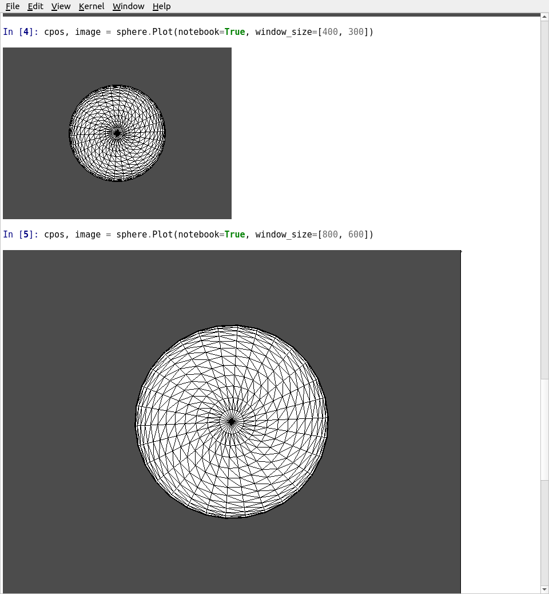

.. _plotting_ref:

Plotting
========

When plotting with the interactive rendering windows in VTK, several keyboard
shortcuts are available:

+-------------------------------------+-----------------+-----------------------------------------------------+
| Key                                                   | Action                                              |
+=====================================+=================+=====================================================+
| Linux/Windows                       | Mac             |                                                     |
+-------------------------------------+-----------------+-----------------------------------------------------+
| ``q``                                                 | Close the rendering window                          |
+-------------------------------------+-----------------+-----------------------------------------------------+
| ``v``                                                 | Isometric camera view                               |
+-------------------------------------+-----------------+-----------------------------------------------------+
| ``w``                                                 | Switch all datasets to a `wireframe` representation |
+-------------------------------------+-----------------+-----------------------------------------------------+
| ``r``                                                 | Reset the camera to view all datasets               |
+-------------------------------------+-----------------+-----------------------------------------------------+
| ``s``                                                 | Switch all datasets to a `surface` representation   |
+-------------------------------------+-----------------+-----------------------------------------------------+
| ``shift+click`` or ``middle-click`` | ``shift+click`` | Pan the rendering scene                             |
+-------------------------------------+-----------------+-----------------------------------------------------+
| ``left-click``                      | ``cmd+click``   | Rotate the rendering scene in 3D                    |
+-------------------------------------+-----------------+-----------------------------------------------------+
| ``ctrl+click``                      |                 | Rotate the rendering scene in 2D (view-plane)       |
+-------------------------------------+-----------------+-----------------------------------------------------+
| ``mouse-wheel`` or ``right-click``  | ``ctl+click``   | Continuously zoom the rendering scene               |
+-------------------------------------+-----------------+-----------------------------------------------------+

Convenience Functions
---------------------

.. autofunction:: pyvista.plot

.. autofunction:: pyvista.plot_arrows

.. autofunction:: pyvista.set_plot_theme

Base Plotter
------------

The base plotter class that all PyVista plotters inherit. Please note that the
:class:`pyvista.BackgroundPlotter` is documented under :ref:`qt_ref`.

.. rubric:: Attributes

.. autoautosummary:: pyvista.BasePlotter
   :attributes:

.. rubric:: Methods

.. autoautosummary:: pyvista.BasePlotter
   :methods:

.. autoclass:: pyvista.BasePlotter
   :show-inheritance:
   :members:
   :undoc-members:

Plotter
-------

.. rubric:: Attributes

.. autoautosummary:: pyvista.Plotter
   :attributes:

.. rubric:: Methods

.. autoautosummary:: pyvista.Plotter
   :methods:

.. autoclass:: pyvista.Plotter
   :show-inheritance:
   :members:
   :undoc-members:

Renderer
--------

.. rubric:: Attributes

.. autoautosummary:: pyvista.Renderer
   :attributes:

.. rubric:: Methods

.. autoautosummary:: pyvista.Renderer
   :methods:

.. autoclass:: pyvista.Renderer
   :show-inheritance:
   :members:
   :undoc-members:

Plotting in a Jupyter Notebook
------------------------------

Inline plots are possible using a Jupyter notebook.  The code snippet below
will create a static screenshot of the rendering and display it in the Jupyter
notebook:

.. code:: python

    import pyvista as pv
    sphere = pv.Sphere()

    # short example
    cpos, image = sphere.plot(notebook=True)

    # long example
    plotter = pv.Plotter(notebook=True)
    plotter.add_mesh(sphere)
    plotter.plot()

    Jupyter Inline Plotting

To display interactive plots in Jupyter notebooks, use the
:class:`pyvista.BackgroundPlotter` to open a rendering window in the background
that you can manipulate in real time from the Jupyter notebook:

.. code-block:: python

    import pyvista as pv
    from pyvista import examples

    dataset = examples.load_uniform()

    plotter = pv.BackgroundPlotter()
    plotter.add_mesh(dataset)

    # Then in another cell, you can add more to the plotter
    plotter.show_bounds()

Background Plotting
-------------------

PyVista provides a plotter that enables users to create a rendering window in
the background that remains interactive while the user performs their
processing. This creates the ability to make a rendering scene and interactively
add or remove datasets from the scene as well as has some useful menu functions
for common scene manipulation or export tasks. To get started, try instantiating
the :class:`pyvista.BackgroundPlotter`:

.. code:: python

    import pyvista as pv
    from pyvista import examples

    dataset = examples.load_hexbeam()

    p = pv.BackgroundPlotter()

    p.add_mesh(dataset)

    p.show_bounds(grid=True, location='back')

IPython Interactive Plotting Tools
----------------------------------

PyVista comes packed with several interactive plotting tools to make using the
filters a bit more intuitive (see :ref:`ipy_tools_ref`).
If in an IPython environment, call one of the tools on an input dataset to yield
widgets that will control a filter or task in an interactive rendering scene.
These tools create an :class:`pyvista.BackgroundPlotter` instance which can be
accessed under the ``.plotter`` attribute for further scene manipulation:

.. code:: python

   import pyvista as pv
   from pyvista import examples

   dataset = examples.load_hexbeam()

   # Use the slicer tool
   tool = pv.OrthogonalSlicer(dataset)

   # Get the plotter for adding more datasets:
   p = tool.plotter
   p.show_grid()

.. figure:: ../images/gifs/slicer-tool.gif
   :width: 500pt

Plot Time Series Data
---------------------

This example outlines how to plot data where the spatial reference and data
values change through time:

.. code-block:: python

    from threading import Thread
    import time
    import numpy as np
    import pyvista as pv
    from pyvista import examples

    globe = examples.load_globe()
    globe.point_arrays['scalars'] = np.random.rand(globe.n_points)
    globe.set_active_scalar('scalars')

    plotter = pv.BackgroundPlotter()
    plotter.add_mesh(globe, lighting=False, show_edges=True, texture=True, scalars='scalars')
    plotter.view_isometric()

    # shrink globe in the background
    def shrink():
        for i in range(50):
            globe.points *= 0.95
            # Update scalars
            globe.point_arrays['scalars'] = np.random.rand(globe.n_points)
            time.sleep(0.5)

    thread = Thread(target=shrink)
    thread.start()

.. figure:: ../images/gifs/shrink-globe.gif
