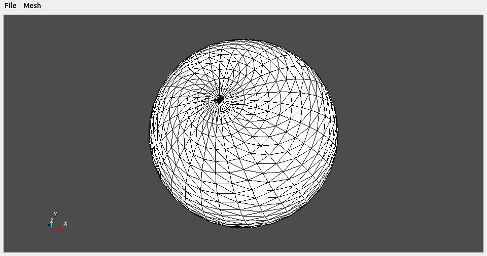

.. _qt_ref:

PyVista PyQt Interface
======================

PyVista has an interface for placing plots in ``PyQt5`` that extends the functionality of the ``QVTKRenderWindowInteractor`` class.  The ``pyvista.QtInteractor`` class allows you to have the same functionality of the ``Plotter`` class within a ``PyQt5`` application.  This simplifies adding meshes, updating, and controlling them when using ``PyQt5``.

Example PyQt5 PyVista QtInteractor
~~~~~~~~~~~~~~~~~~~~~~~~~~~~~~~~~~

The following example shows how to create a simple application that adds a
sphere to an empty plotting window.

.. code:: python

    import sys

    from PyQt5 import Qt
    import numpy as np

    import pyvista as pv

    class MainWindow(Qt.QMainWindow):

        def __init__(self, parent=None, show=True):
            Qt.QMainWindow.__init__(self, parent)

	    # create the frame
            self.frame = Qt.QFrame()
            vlayout = Qt.QVBoxLayout()

	    # add the pyvista interactor object
            self.vtk_widget = pv.QtInteractor(self.frame)
            vlayout.addWidget(self.vtk_widget)

            self.frame.setLayout(vlayout)
            self.setCentralWidget(self.frame)

	    # simple menu to demo functions
            mainMenu = self.menuBar()
            fileMenu = mainMenu.addMenu('File')
            exitButton = Qt.QAction('Exit', self)
            exitButton.setShortcut('Ctrl+Q')
            exitButton.triggered.connect(self.close)
            fileMenu.addAction(exitButton)

	    # allow adding a sphere
            meshMenu = mainMenu.addMenu('Mesh')
            self.add_sphere_action = Qt.QAction('Add Sphere', self)
            self.add_sphere_action.triggered.connect(self.add_sphere)
            meshMenu.addAction(self.add_sphere_action)

            if show:
                self.show()

        def add_sphere(self):
	    """ add a sphere to the pyqt frame """
            sphere = pv.Sphere()
            self.vtk_widget.add_mesh(sphere)
            self.vtk_widget.reset_camera()

    if __name__ == '__main__':
        app = Qt.QApplication(sys.argv)
        window = MainWindow()
        sys.exit(app.exec_())

    PyQt5 pyvista QtInteractor

Background Plotting
~~~~~~~~~~~~~~~~~~~

Normal PyVista plotting windows exhibit blocking behavior, but it is possible
to plot in the background and update the plotter in real-time using the
``BackgroundPlotter`` object.  This requires ``PyQt5``, but otherwise appears
and functions like a normal PyVista ``Plotter`` instance.  For example:

.. code:: python

    import pyvista as pv

    sphere = pv.Sphere()

    plotter = pv.BackgroundPlotter()
    plotter.add_mesh(sphere)

    # can now operate on the sphere and have it updated in the background
    sphere.points *= 0.5

.. rubric:: Attributes

.. autoautosummary:: pyvista.BackgroundPlotter
   :attributes:

.. rubric:: Methods

.. autoautosummary:: pyvista.BackgroundPlotter
   :methods:

.. autoclass:: pyvista.BackgroundPlotter
   :members:
   :undoc-members:
   :show-inheritance:

.. autoclass:: pyvista.ScaledPlotter
  :members:
  :undoc-members:
  :show-inheritance:
