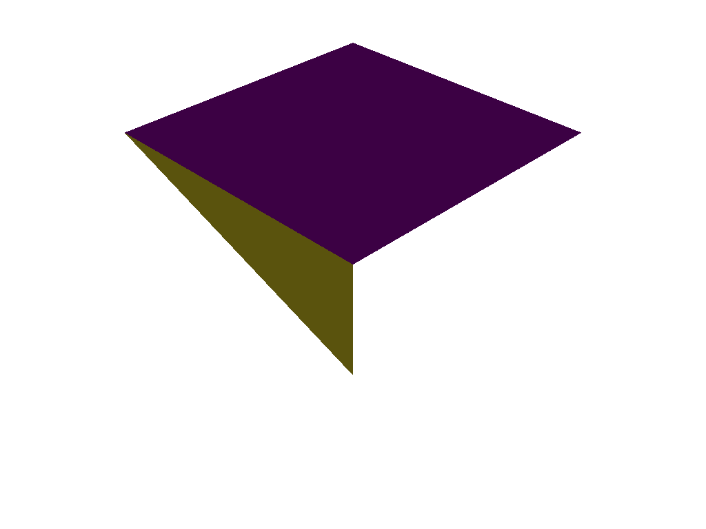
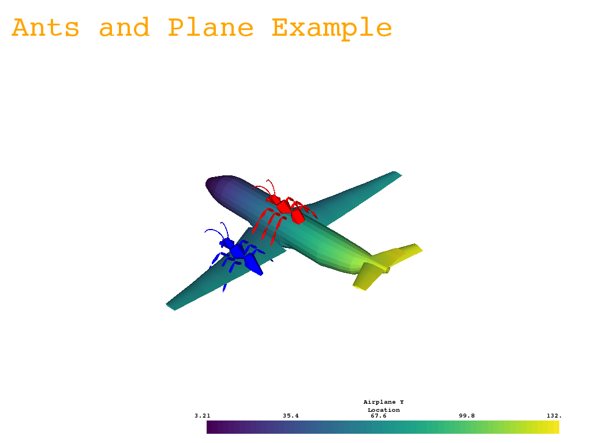
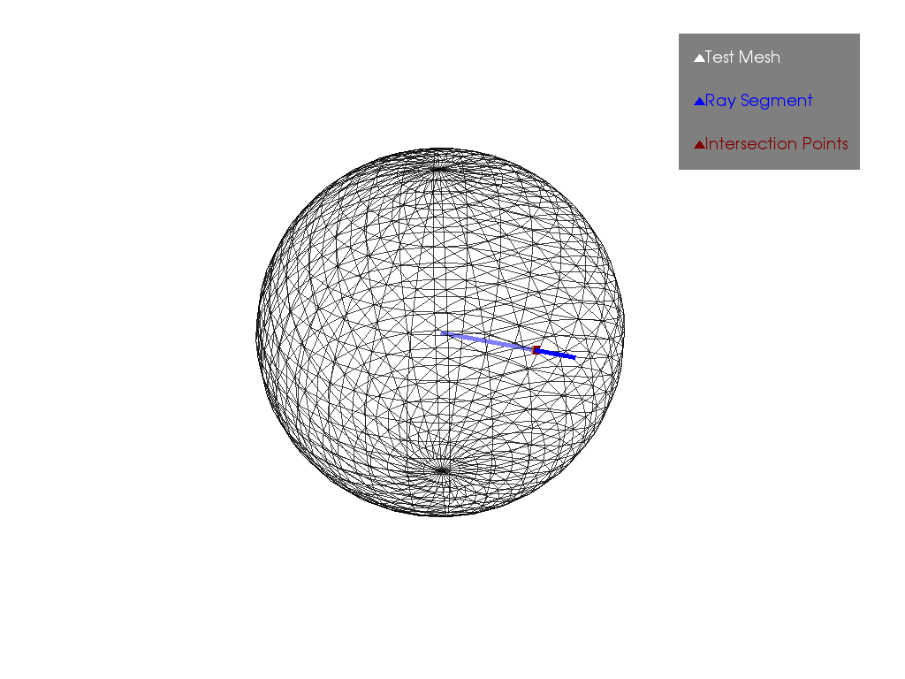

Point Data
==========
The ``vtki.PolyData`` object adds additional functionality to the
``vtk.vtkPolyData`` object, to include direct array access through numpy,
one line plotting, and other mesh functions.

PolyData Creation
-----------------

Empty Object
~~~~~~~~~~~~
A polydata object can be initialized with:

.. testcode:: python

    import vtki
    grid = vtki.PolyData()

This creates an empty grid, and is not useful until points and cells are added
to it.  VTK points and cells can be added with ``SetPoints`` and ``SetCells``,
but the inputs to these need to be ``vtk.vtkCellArray`` and ``vtk.vtkPoints``
objects, which need to be populated with values.
Grid creation is simplified by initializing the grid directly from numpy
arrays as in the following section.

Initialize from Numpy Arrays
~~~~~~~~~~~~~~~~~~~~~~~~~~~~
A PolyData object can be created quickly from numpy arrays.  The vertex array
contains the locations of the points of the mesh and the face array contains the
number of points for each face and the indices of each of those faces.

.. testcode:: python

    import numpy as np
    import vtki

    # mesh points
    vertices = np.array([[0, 0, 0],
                         [1, 0, 0],
                         [1, 1, 0],
                         [0, 1, 0],
			 [0.5, 0.5, -1]])

    # mesh faces
    faces = np.hstack([[4, 0, 1, 2, 3],  # square
                       [3, 0, 1, 4],     # triangle
                       [3, 1, 2, 4]])    # triangle

    surf = vtki.PolyData(vertices, faces)

    # plot each face with a different color
    surf.plot(scalars=np.arange(3), screenshot='./images/samplepolydata.png')

Initialize from a File
~~~~~~~~~~~~~~~~~~~~~~
Both binary and ASCII .ply, .stl, and .vtk files can be read using vtki.
For example, the vtki package contains example meshes and these can be loaded with:

.. testcode:: python

    import vtki
    from vtki import examples

    # Load mesh
    mesh = vtki.PolyData(examples.planefile)

This mesh can then be written to a vtk file using:

.. testcode:: python

    mesh.save('plane.vtk')

These meshes are identical.

.. code:: python

    import numpy as np

    mesh_from_vtk = vtki.PolyData('plane.vtk')
    print(np.allclose(mesh_from_vtk.points, mesh.points))

.. testcleanup:: python

   import os
   try:
       os.remove('plane.vtk')
   except FileNotFoundError:
       pass

Mesh Manipulation and Plotting
------------------------------
Meshes can be directly manipulated using numpy or with the built-in translation
and rotation routines.
This example loads two meshes and moves, scales, and copies them.

.. testcode:: python

    import vtki
    from vtki import examples

    # load and shrink airplane
    airplane = vtki.PolyData(examples.planefile)
    airplane.points /= 10 # shrink by 10x

    # rotate and translate ant so it is on the plane
    ant = vtki.PolyData(examples.antfile)
    ant.rotate_x(90)
    ant.translate([90, 60, 15])

    # Make a copy and add another ant
    ant_copy = ant.copy()
    ant_copy.translate([30, 0, -10])

To plot more than one mesh a plotting class must be created to manage the plotting.
The following code creates the class and plots the meshes with various colors.

.. testcode:: python

    # Create plotting object
    plotter = vtki.Plotter()
    plotter.add_mesh(ant, 'r')
    plotter.add_mesh(ant_copy, 'b')

    # Add airplane mesh and make the color equal to the Y position.  Add a
    # scalar bar associated with this mesh
    plane_scalars = airplane.points[:, 1]
    plotter.add_mesh(airplane, scalars=plane_scalars, stitle='Airplane Y\nLocation')

    # Add annotation text
    plotter.add_text('Ants and Plane Example')
    plotter.plot(screenshot='./images/AntsAndPlane.png')

Ray Tracing
-----------
vtki supports single line segment ray tracing.

.. testcode:: python

    # Use built-in sphere and test against a single ray
    import vtki

    sphere = vtki.Sphere(radius=0.85)

    start = [0, 0, 0]
    stop = [0.25, 1, 0.5]
    points, ind = sphere.ray_trace(start, stop)
    ray = vtki.Line(start, stop)
    intersection = vtki.PolyData(points)

    p = vtki.Plotter()
    p.add_mesh(sphere, show_edges=True, opacity=0.5, color='w', lighting=False, label='Test Mesh')
    p.add_mesh(ray, color='blue', line_width=5, label='Ray Segment')
    p.add_mesh(intersection, color='maroon', point_size=10, label='Intersection Points')
    p.add_legend()
    p.show(screenshot='./images/intersection_sphere.png')

vtki.PolyData Grid Class Methods
----------------------------------------
The following is a description of the methods available to a ``vtki.PolyData``
object.  It inherits all methods from the original vtk object,
`vtk.vtkPolyData <https://www.vtk.org/doc/nightly/html/classvtkPolyData.html>`_.

.. rubric:: Attributes

.. autoautosummary:: vtki.PolyData
   :attributes:

.. rubric:: Methods

.. autoautosummary:: vtki.PolyData
   :methods:

.. autoclass:: vtki.PolyData
   :show-inheritance:
   :members:
   :undoc-members:
