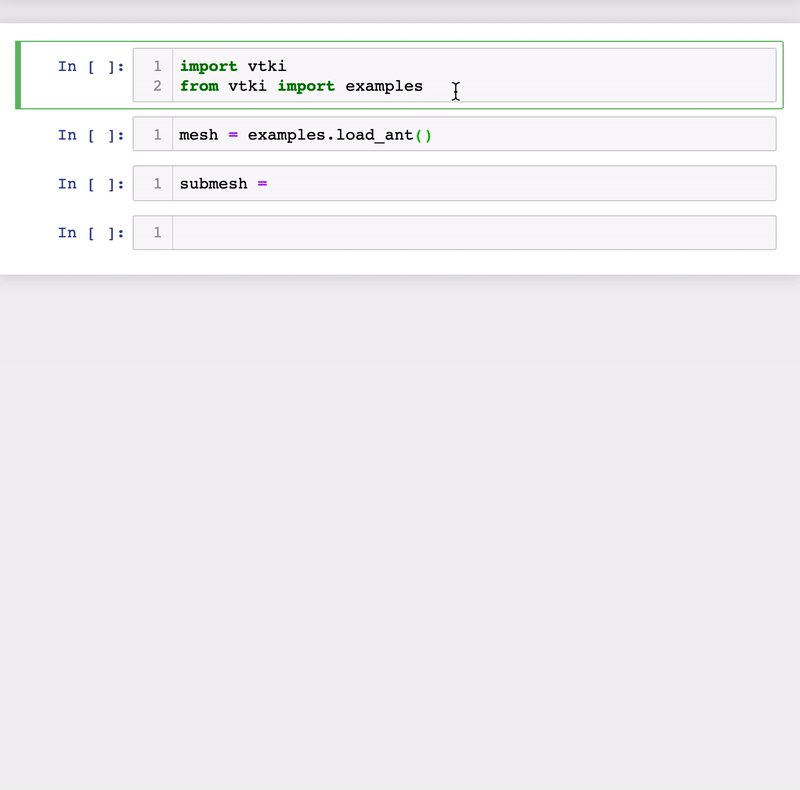

Why PyVista?
============

VTK is an excellent visualization toolkit, and with Python bindings it should be
able to combine the speed of C++ with the rapid prototyping of Python.
However, despite this VTK code programmed in Python generally looks the same as
its C++ counterpart.  This module seeks to simplify mesh creation and plotting
without losing functionality.

Compare two approaches for loading and plotting a surface mesh from a file:

Plotting a Mesh using Python's VTK
~~~~~~~~~~~~~~~~~~~~~~~~~~~~~~~~~~
Using this `example <http://www.vtk.org/Wiki/VTK/Examples/Python/STLReader>`_,
loading and plotting an STL file requires a lot of code when using only the
``vtk`` module.

.. code:: python

    import vtk

    # create reader
    reader = vtk.vtkSTLReader()
    reader.SetFileName("myfile.stl")

    mapper = vtk.vtkPolyDataMapper()
    if vtk.VTK_MAJOR_VERSION <= 5:
        mapper.SetInput(reader.GetOutput())
    else:
        mapper.SetInputConnection(reader.GetOutputPort())

    # create actor
    actor = vtk.vtkActor()
    actor.SetMapper(mapper)

    # Create a rendering window and renderer
    ren = vtk.vtkRenderer()
    renWin = vtk.vtkRenderWindow()
    renWin.AddRenderer(ren)

    # Create a renderwindowinteractor
    iren = vtk.vtkRenderWindowInteractor()
    iren.SetRenderWindow(renWin)

    # Assign actor to the renderer
    ren.AddActor(actor)

    # Enable user interface interactor
    iren.Initialize()
    renWin.Render()
    iren.Start()

    # clean up objects
    del iren
    del renWin

Plot a Mesh using PyVista
~~~~~~~~~~~~~~~~~~~~~~~~~

The same stl can be loaded and plotted using pyvista with:

.. code:: python

    import pyvista

    mesh = pyvista.PolyData('myfile.stl')
    mesh.plot()

The mesh object is more pythonic and the code is much more straightforward.
Garbage collection is taken care of automatically and the renderer is cleaned up
after the user closes the VTK plotting window.

Advanced Plotting with Numpy
~~~~~~~~~~~~~~~~~~~~~~~~~~~~

When combined with numpy, you can make some truly spectacular plots:

.. testcode:: python

    import pyvista
    import numpy as np

    # Make a grid
    x, y, z = np.meshgrid(np.linspace(-5, 5, 20),
                          np.linspace(-5, 5, 20),
                          np.linspace(-5, 5, 5))

    points = np.empty((x.size, 3))
    points[:, 0] = x.ravel('F')
    points[:, 1] = y.ravel('F')
    points[:, 2] = z.ravel('F')

    # Compute a direction for the vector field
    direction = np.sin(points)**3

    # plot using the plotting class
    plobj = pyvista.Plotter()
    plobj.add_arrows(points, direction, 0.5)
    plobj.show(screenshot='vectorfield.png')

.. image:: ./images/auto-generated/vectorfield.png

While not everything can be simplified without losing functionality, many of the
objects can.  For example, triangular surface meshes in VTK can be subdivided
but every other object in VTK cannot.  It then makes sense that a subdivided
method be added to the existing triangular surface mesh.
That way, subdivision can be performed with:

.. code:: python

    from pyvista import examples
    mesh = examples.load_ant()
    submesh = mesh.subdivide(3, 'linear')

Additionally, the docstrings for all methods in PyVista are intended to be used
within interactive coding sessions. This allows users to use sophisticated
processing routines on the fly with immediate access to a description of how to
use those methods:

