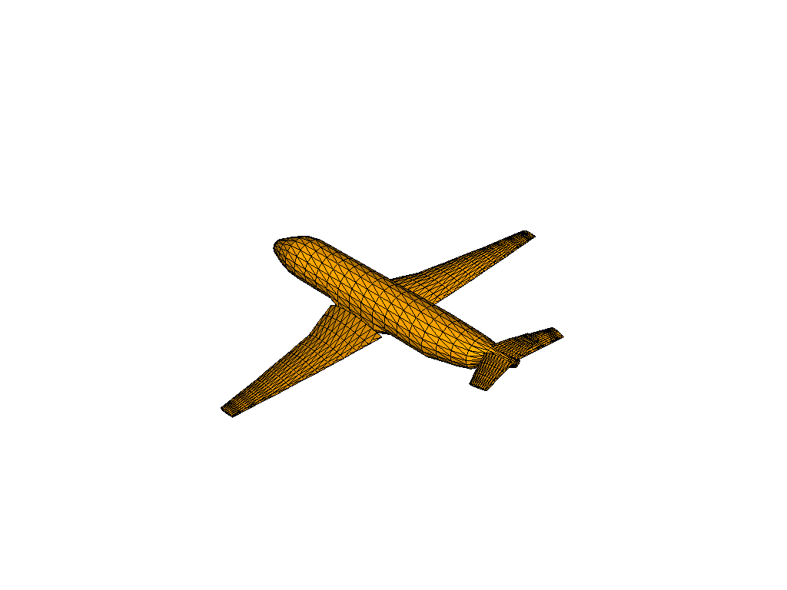
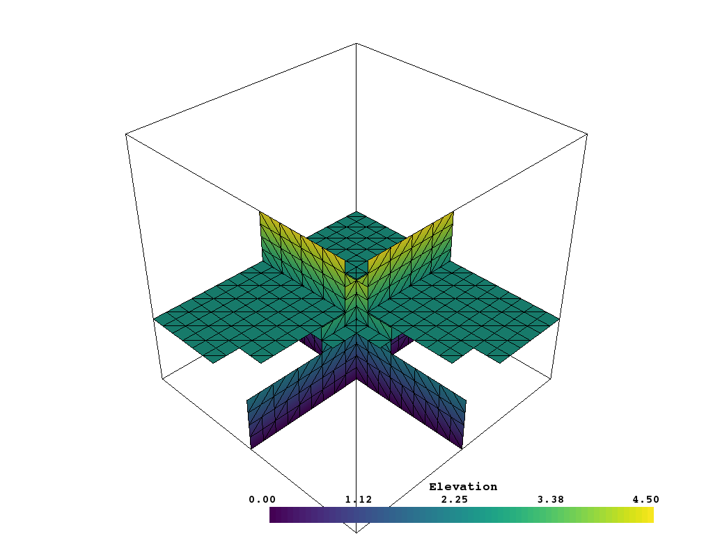

# Summary

The Visualization Toolkit (VTK) is an excellent visualization software
library, and with Python bindings it combines the speed of C++ with
the rapid prototyping of Python [@vtkbook].  Despite this, VTK code
programmed in Python using the base package provided by Kitware is
unnecessarily complex as the Python package merely wraps existing C++
calls. This Python package seeks to simplify common mesh creation and
plotting routines without compromising on the speed of the C++ VTK
backend.  At its core, `vtki` is a pure Python helper module for VTK
that interfaces back to VTK data objects through NumPy [@numpy]
and direct array access.  This package expands upon VTK's data objects
by creating classes that extend their VTK counterpart.  VTK data
objects passed to `vtki` have an added layer of functionality on top
of that object providing a wrapping layer that creates an accessible
and intuitive interface back to the VTK library to foster rapid
prototyping and analysis of VTK datasets.

## Simplified Plotting Routines

Plotting VTK datasets using only the VTK Python package is often an ambitious
programming endeavor. Reading a VTK supported file and plotting it requires a
user to write a complicated sequence of routines to render the data object while
having to remember which VTK classes to use for file reading and dataset mapping.
An example can be found in [this creative commons VTK example](https://vtk.org/Wiki/VTK/Examples/Python/STLReader).

`vtki` includes numerous plotting routines that are intended to be intuitive and
highly controllable with `matplotlib` [@matplotlib] similar syntax and keyword
arguments.
These plotting routines are defined to make the rendering process
straightforward and easily implemented by novice VTK users. Loading and
rendering in `vtki` is implemented to take only a few lines of code:

```python
# Obligatory set up code
import vtki
from vtki import examples
import numpy as np
# Set a document friendly plotting theme
vtki.set_plot_theme('document')
```

```python
filename = examples.planefile
mesh = vtki.read(filename)
mesh.plot(show_edges=True, screenshot='./images/airplane.png')
```



Notably, the `vtki.plot()` convenience method is bound to each `vtki`
data object to make visual inspection of datasets easily performed. Other
plotting routines in `vtki` are available for creating integrated and
easily manipulated scenes via the `vtki.Plotter` and `vtki.BackgroundPlotter`
classes. Creating a rendering scene and altering its properties can be performed
with the following code in `vtki`:

```python
plotter = vtki.Plotter()
plotter.add_mesh(mesh, color='yellow')
plotter.show_grid()
plotter.show()
```


## Data Types & Mesh Creation

Datasets are any spatially referenced information and usually consist of
geometrical representations of a surface or volume in 3D space.
In VTK, the abstract class `vtk.vtkDataSet` represents a set of common
functionality for spatially referenced datasets [@vtkbook].
In `vtki`, the common functionality shared across spatially referenced datasets
is shared in the `vtki.Common` class which holds methods and attributes for
quickly accessing scalar arrays associated with the dataset or easily inspecting
attributes of the dataset such as all the scalar names or number of points
present.

All of the following data types are subclasses of their corresponding VTK class
and share a set of common functionality which `vtki` implements into the base
class  `vtki.Common`.

| VTK Class                  | `vtki` Implementation   |
|----------------------------|-------------------------|
| `vtk.vtkDataSet`           | `vtki.Common`           |
| `vtk.vtkPolyData`          | `vtki.PolyData`         |
| `vtk.vtkUnstructuredGrid`  | `vtki.UnstructuredGrid` |
| `vtk.vtkStructuredGrid`    | `vtki.StructuredGrid`   |
| `vtk.vtkRectilinearGrid`   | `vtki.RectilinearGrid`  |
| `vtk.vtkImageData`         | `vtki.UniformGrid`      |
| `vtk.vtkMultiBlockDataSet` | `vtki.MultiBlock`       |


Creating mesh objects in VTK is also simplified by `vtki` by providing intuitive
initialization functions and attributes on the `vtki` classes that callback to
the original VTK data object. Loading files supported by the VTK library is also
simplified with a module level function to decide on the appropriate reader for
the file.

```python
filename = 'path/to/vtk/supported/file.ext'
mesh = vtki.read(filename)
```


## Accessing Common Analysis Routines

`vtki` wrapped data objects have a suite of common filters ready for immediate
use directly on the objects. These filters are commonly used algorithms in the
VTK library that have been made more accessible by binding a method to control
that algorithm directly onto all `vtki` datasets. These filtering algorithms are
held in the `vtki.DataSetFilters` class which is inherited by the `vtki.Common`
class giving all datasets a shared set of functionality.
Through the use of these bound methods, powerful VTK filtering algorithms can
be leveraged with intuitive control via keyword arguments in Python.
These filters can be used by calling the filtering method directly from the data
object:

```python
# Load a sample UniformGrid
dataset = examples.load_uniform()
# Apply a threshold over a data range
result = dataset.threshold([100, 500])
```

Above, an extracted version of the input dataset where the active scalar array
is between 100 and 500 is created in the new `result` object.
Documentation of the available keyword arguments to control the
filtering algorithms are described in the documentation of each filtering
method.

### Filtering Chain

In VTK, filters are often used in a pipeline where each algorithm passes its
output to the next filtering algorithm [@vtkbook].
`vtki` mimics the filtering pipeline through a chain; attaching each filter to
the last filter. In the following example using the sample dataset from above,
several filters are chained together.

1. A threshold filter to extract a range of the active scalar array.
2. An elevation filter to generate scalar values corresponding to height.
3. A clip filter to cut the dataset in half.
4. Create three slices along each axial plane.

```python
# Apply a filtering chain
result = dataset.threshold([100, 500], invert=True).elevation().clip(normal='z').slice_orthogonal()
```

```python
p = vtki.Plotter()
p.add_mesh(dataset.outline(), color='black')
p.add_mesh(result, scalars='Elevation', show_edges=True, font_size=12)
p.isometric_view()
p.show(screenshot='./images/filter-chain.png')
```




## References
