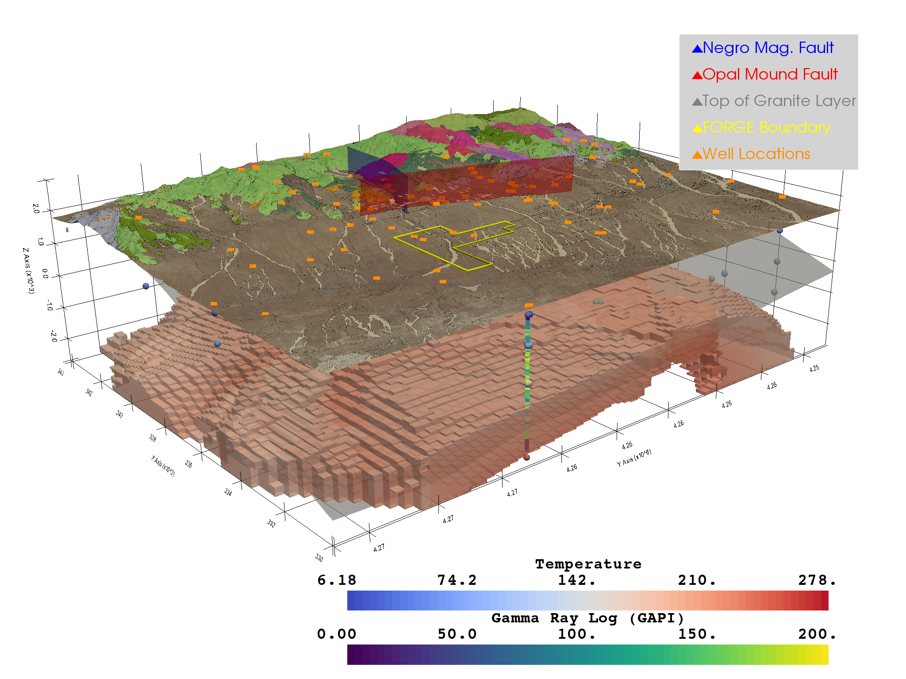
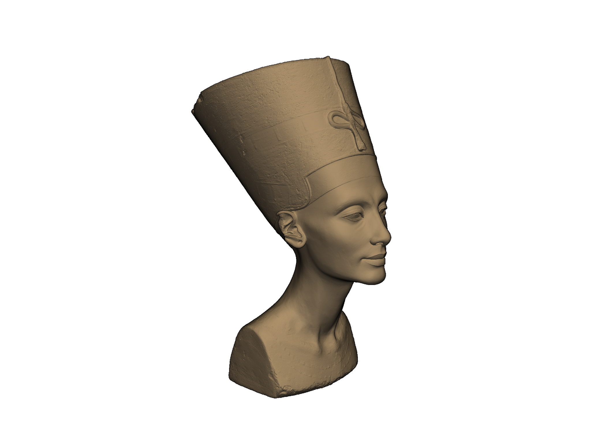
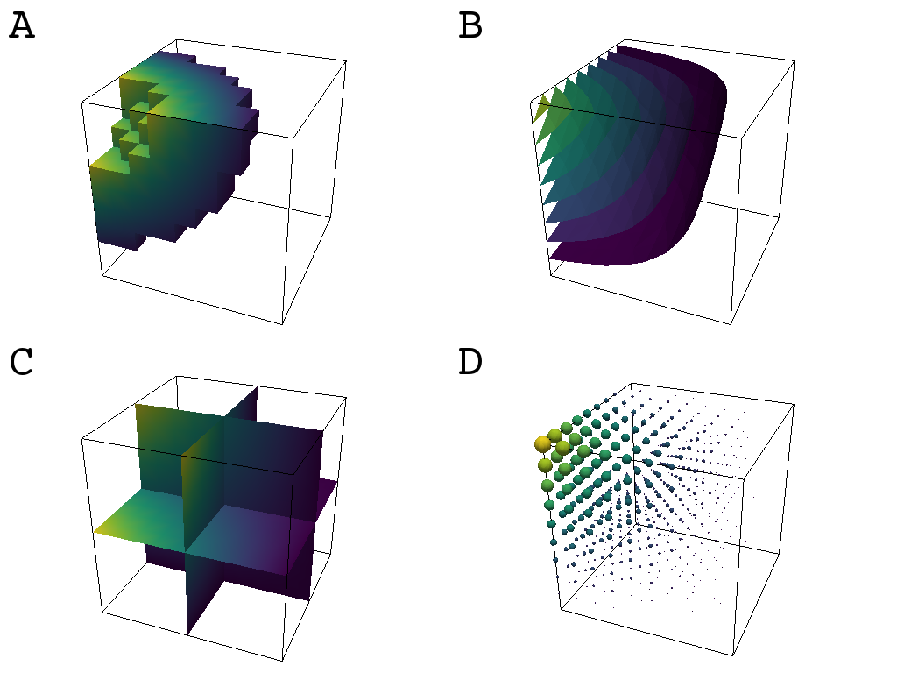

# Summary

The Visualization Toolkit (VTK) is an excellent visualization software
library, and with Python bindings it combines the speed of C++ with
the rapid prototyping of Python [@vtkbook].  Despite this, VTK code
programmed in Python using the base package provided by Kitware is
unnecessarily complex as the Python package merely wraps existing C++
calls. The `vtki` Python package seeks to simplify common mesh creation
and plotting routines without compromising on the speed of the C++ VTK
backend, enabling researchers to rapidly explore large datasets,
communicate their spatial findings, and facilitate reproducibility.
Figure 1 demonstrates an integrated scene of geospatial data generated
by `vtki`; to learn more about how this visualization was created,
please visit [PVGeo's FORGE project website](http://forge.pvgeo.org).



**Figure 1:** A visually integrated scene of geospatial data
(FORGE Geothermal Site). This rendering includes a digital land surface
with overlain satellite imagery and geologic map, a subsurface temperature
model, scattered points of the sampled temperature values, geophysical well
logging data, GIS site boundary, and interpreted faulting surfaces.


At its core, `vtki` is a pure Python helper module for VTK
that interfaces back to VTK data objects through NumPy [@numpy]
and direct array access adhering to VTK's object oriented approach to
3D visualization [@vtkbook]. This package expands upon VTK's data types
by creating classes that extend their VTK counterpart.
The `vtki` wrapping layer provides an accessible and intuitive interface back
to the VTK library to facilitate rapid prototyping, analysis, and visual
integration of spatially referenced datasets.


## Simplified Plotting Routines

Plotting VTK datasets using only the VTK Python package or a similar
visualization library is often an ambitious programming endeavor.
Reading a VTK supported file and plotting it requires a user to write a
complicated sequence of routines to render the data object while
having to remember which VTK classes to use for file reading and dataset mapping.
An example can be found in [this creative commons VTK example](https://vtk.org/Wiki/VTK/Examples/Python/STLReader).

`vtki` includes plotting routines that are intended to be intuitive and
highly controllable with `matplotlib` [@matplotlib] similar syntax and keyword
arguments. These plotting routines are defined to make the process of
visualizing spatially referenced data straightforward and easily implemented
by novice programmers. Loading and rendering of sophisticated meshes in `vtki`
is implemented to take only a few lines of code:

```python
from vtki import examples
# Example mesh of Queen Nefertiti
mesh = examples.download_nefertiti()
# Render the dataset
mesh.plot(cpos=[-1,-1,0.2], eye_dome_lighting=True)
```

{width=75%}
**Figure 2:** Rendering of the Queen Nefertiti example mesh consisting of approximately 2 million triangles.


Notably, the `.plot()` convenience method is bound to each `vtki`
data object to make visual inspection of datasets easily performed. Other
plotting routines are available in `vtki` for creating integrated and
easily manipulated scenes like that show in Figure 1.


## Data Types & Mesh Creation

Datasets are any spatially referenced information and usually consist of
geometrical representations of a surface or volume in 3D space.
In VTK, the abstract class `vtk.vtkDataSet` represents a set of common
functionality for spatially referenced datasets [@vtkbook].
In `vtki`, the common functionality shared across spatially referenced datasets
is shared in the `vtki.Common` class which holds methods and attributes for
quickly accessing scalar arrays or inspecting properties of the dataset such
as the available scalar names or number of points present.

Creating mesh objects in VTK is also simplified by `vtki` by providing intuitive
initialization functions and attributes on the `vtki` classes that callback to
the original VTK data object. Loading files supported by the VTK library is also
simplified with a module level function to decide on the appropriate reader for
supported file types.


## Accessing Common Analysis Routines

`vtki` wrapped data objects have a suite of common filters ready for immediate
use directly on the objects. These filters are commonly used algorithms in the
VTK library that have been made more accessible by binding a method to control
that algorithm directly onto all `vtki` datasets. These filtering algorithms are
inherited by all dataset classes providing a shared set of functionality.
Through the use of these bound filtering methods, powerful VTK algorithms
can be leveraged and controlled via keyword arguments designed to be intuitive
for novice users. Below is a programmatic example of the filtering workflow
and Figure 3 show examples of common filtering algorithms.

```python
# Load an example uniform grid
dataset = examples.load_uniform()
# Apply a threshold over a data range
threshed = dataset.threshold([100, 500]) # Figure 4 A
```


**Figure 3:** Examples of common filtering algorithms: A) threshold volume
extraction by scalar array, B) iso-contouring by scalar array, C) orthogonal
slicing through volume, and D) geometric glyphing at mesh nodes and scaled by
a scalar array.


### Filtering Chain

In VTK, filters are often used in a pipeline where each algorithm passes its
output to the next filtering algorithm [@vtkbook].
`vtki` mimics the filtering pipeline through a chain; attaching each filter to
the last filter. The following code provides an example of how filtering
algorithms can be combined into a chain mimicking the VTK pipeline.

```python
# Apply a filtering chain
result = dataset.threshold([100, 500],
                           invert=True).elevation().slice_orthogonal()
```


## Mentions

`vtki` is used extensively by the Air Force Research Labs (AFRL) for
data visualization and plotting.  These research articles include
figures visualizing 3D tessellated models generated from structured
light optical scanner and results from finite element analysis, both
of which are particularly suited to `vtki`: [@Gillaugh2017], [@Brown2018],
[@Brown2018_pro], [@Beck2018_subspace], [@Kaszynski2018], [@Gillaugh2018_art],
[@Gillaugh2019]

[PVGeo](https://github.com/OpenGeoVis/PVGeo) is Python package of VTK-based
algorithms to analyze geoscientific data and models. ``vtki`` is used to make
the inputs and outputs of PVGeo's algorithms more accessible and to streamline
the process of visualizing geoscientific data.


## References
